# IBM Concert Protect — Jeu de données de démonstration

## Concert on VM installation (WSL)

https://access.redhat.com/downloads/content/479/ver=/rhel---10/10.1/x86_64/product-software

https://access.cdn.redhat.com/content/origin/files/sha256/e1/e1871004d0075e0ce10cfb4c1aae7c1fb56cf2162e9d494d1f9c9d061902fec6/rhel-10.1-x86_64-wsl2.wsl?user=ff36eb482f8e8e5f91eeea57bbff8436&_auth_=1788010586_4aa6065c03dea6850c7411398660aa1a

https://note.com/fminamot/n/n6672efe59fe3?hl=en

```
wget ..rhel-10.1-x86_64-wsl2.wsl "C:\D1To\Perso\Patrick\produits\Linux\RHEL10 WSL\rhel-10.1-x86_64-wsl2.wsl"  
wsl --import RHEL-10.1 RHEL-10.1 "C:\D1To\Perso\Patrick\produits\Linux\RHEL10 WSL\rhel-10.1-x86_64-wsl2.wsl"  

```

Use vi to add the following **/etc/wsl.conf** to the **[network]** section.

```
[boot]
systemd = true

[network]
hostname = rhel10
generateHosts = false
```

Furthermore, add the following line to **/etc/hosts** .

```yaml
127.0.0.1   localhost
127.0.0.1 rhel10　#
```

```
subscription-manager register
```

```
dnf repolist
Updating Subscription Management repositories.
repo id                                         repo name
rhel-10-for-x86_64-appstream-rpms               Red Hat Enterprise Linux 10 for x86_64 - AppStream (RPMs)
rhel-10-for-x86_64-baseos-rpms                  Red Hat Enterprise Linux 10 for x86_64 - BaseOS (RPMs)
```

```
 dnf update -y
```


```
systemctl start -p ExecStart --value k3s
systemctl show -p ExecStart --value k3s
k3s check-config

k3s kubectl get ns
NAME                         STATUS   AGE
default                      Active   4d8h
ibm-concert                  Active   4d8h
ibm-concert-dataapps         Active   4d8h
ibm-concert-workflows        Active   4d8h
ibm-concert-workflows-faas   Active   4d1h
ibm-platform-hub             Active   4d8h
kube-node-lease              Active   4d8h
kube-public                  Active   4d8h
kube-system                  Active   4d8h

```

```
concert_hot : https://172.22.147.223:12443/concert
```


## Contexte

Application fictive **TechCorp ERP v3.4.1** — système ERP critique (finance, RH, supply chain)  
Environnements : `prod-eu-west-1` (RHEL 8.9 + Windows Server 2022 + Kubernetes) et `staging-eu-west-1`

watsonx:

projectid = 7aa1b6d2-c471-4f38-9210-acbd2d76539b

```
export WATSONX_API_KEY=ssyGuMlb_C4ckSHGAHR_LLM84hSy-nxWxHsNDkMkoKrU
export WATSONX_API_PROJECT_ID=7aa1b6d2-c471-4f38-9210-acbd2d76539b
export WATSONX_API_URL=https://eu-de.ml.cloud.ibm.com
export CONCERT_NAMESPACE=ibm-concert
```

```
https://github.com/patpot44/demo-locale-concert-active.git
for ticketing 
Host : https://api.github.com/
github token in coud data watsonx instead
ghp_YOUR_GITHUB_TOKEN_HERE_PLACEHOLDER_1
```

````
github.ibm.com for blue-bank (PAT) :

```
ghp_YOUR_GITHUB_TOKEN_HERE_PLACEHOLDER_2
```


````

```
vscode_secure_coder
github.com (PAT) https://api.github.com/

ghp_YOUR_GITHUB_TOKEN_HERE_PLACEHOLDER_3
```


---

## Fichiers à importer dans Concert Protect

| Fichier | Navigation Concert 3.0.x | File type à sélectionner | Format |
|---------|--------------------------|--------------------------|--------|
| `01_application_sbom.json` | `Dimensions > Application` > **Upload application SBOM** | Application SBOM | ConcertDef 2.0.0 JSON |
|  |  |  |  |
| `02_vm_scan.csv` | `Dimensions > Vulnerability` > **Upload vulnerability scan** | Vulnerability scan (VM) | CSV générique |
| `03_image_scan.csv` | `Dimensions > Vulnerability` > **Upload vulnerability scan** | Vulnerability scan (image) | CSV générique |
| `04_code_scan_sast.csv` (faire pour tous les repository) | `Dimensions > Vulnerability` > **Upload vulnerability scan** | Vulnerability scan (source code) | CSV générique |
| `09_dast_scan_exposure.json` ⚠️ **JSON uniquement** (scan source : ZAP ou Others) | `Protect > Vulnerability > Exposures` > **Upload exposures** > **Dynamic scan** | Vulnerability scan (dynamic) | JSON ZAP natif |
| `10_sast_scan_exposure.csv` | `Protect > Vulnerability > Exposures` > **Upload exposures** > **Static scan** | Vulnerability scan (static) | CSV Exposure |
| verifier profile |  |  |  |
| `05_compliance_oscal.json` | `Dimensions > Compliance` > **Upload compliance scan**<br />import mm si erreur, puis saisie des 19 assesment | Compliance assessment | JSON |
| `06_certificate_sbom.json` | `Dimensions > Certificate` > **Upload certificate data** | Certificate                      | ConcertDef 2.0.0 JSON |
| `08_package_sbom_cyclonedx.json` | `Dimensions > Sofware Composition` > **Upload CycloneDX** | CycloneDX | JSON                  |
| suivre la doc pour connecter watsonx.ai<br />https://www.ibm.com/docs/en/concert/3.0.x?topic=deployment-configuring-watsonxai-concert-premises |                                                              |                                  |  |

> **Raccourci :** depuis l'**Arena view**, utilisez **`Define and upload > Upload scan`** pour les scans de vulnérabilité.
>
> **Ordre d'import recommandé :** 01**→ 07**→ 02 → 03 → 04 → (1)→ 05 → 06→ 08 → 09(3)→ 10(2)
>
> avant 5 faire l'étape suivante (1) :

### (1) Vérifier / créer le profil `k8s-cis-1.23`

#### 1. Naviguer vers les profils

Dans l'UI Concert :

```txt
Dimensions  →  Compliance  →  Profiles
```


#### 2. Vérifier si le profil existe déjà

Concert 3.0.x **inclut des profils intégrés** dont le catalogue Kubernetes. Cherche dans la liste un profil nommé exactement **`k8s-cis-1.23`**.

------

#### 3. Si le profil n'existe pas → le créer manuellement

1. Clique **Create profile** → **From resources**
2. **Name** : `k8s-cis-1.23` ← **doit être exactement ce nom** (c'est le `compliance_id` Trivy)
3. **Description** : `CIS Benchmark for Kubernetes v1.23`
4. **Version** : `1.23`
5. **Select catalogs** : sélectionne le catalogue Kubernetes (CIS) disponible
6. **Select controls** : sélectionne tous les contrôles KSV (Kubernetes Security)
7. Clique **Create**

------

#### 4. Vérifier aussi le catalog

Avant de créer le profil, il faut qu'un **catalog Kubernetes/CIS** existe :

```txt
Dimensions  →  Compliance  →  Catalogs
```

### (2) importer 9 et 10


importer 9 en dynamique (correction en cours)

importer 10 pour chaque repository URL :
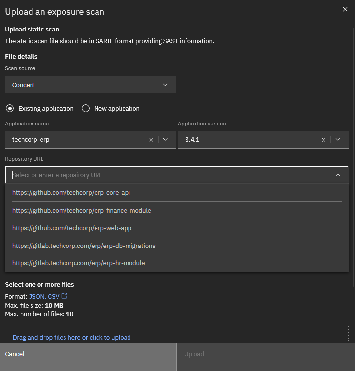


### (3) remplir le menu upload dynamique scan :

Dans le formulaire **Upload dynamic scan** :

| Champ                 | Valeur                       |
| --------------------- | ---------------------------- |
| **Scan source**       | `ZAP` (ou `Others`)          |
| **Access point name** | `TechCorp ERP Production`    |
| **Access point URL**  | `https://erp.techcorp.com`   |
| **Fichier**           | `09_dast_scan_exposure.json` |


---

## Scénarios de démonstration

### 1. Automatisation du patching et réactivité

**Données clés :**

- `CVE-2024-47176` (VM Scan, Risk Score 98) → Auto-patch déclenché → ticket `INC0042001` ouvert dans ServiceNow
- `CVE-2024-38063` (VM Scan, Risk Score 96) → Patch Windows planifié fenêtre maintenance 2025-07-20 02h00
- `CVE-2024-4577` PHP RCE (VM Scan, Risk Score 91) → Patch automatique appliqué

**Message démo :** Concert Protect détecte les CVEs critiques avec exploit disponible et déclenche automatiquement le patching sans intervention humaine, avec ouverture de ticket ServiceNow traçable.

---

### 2. Pertinence et priorisation des actions

**Données clés — Contrast Risk Score vs CVSS brut :**

- [x] Host CVE `CVE-2024-3094` XZ Utils Backdoor : CVSS 10.0 + EPSS 0.97 → Risk Score 99 (supply chain confirmé par Gemini AI)
  
- [ ] `CVE-2024-25600` WordPress : CVSS 9.8 → **faux positif**, hors scope ERP → Accepted Risk

  :arrow_right: 04_code_scan_sast - Copy.csv (2).ok modifier pour ajouter

  cherchez-le dans **Dimensions → Vulnerability**. Une fois visible, vous pourrez le marquer **"Accepted Risk"** avec la justification :

  > *"WordPress Bricks Builder component not used in techcorp-erp production stack. False positive — out of application scope."*

  C'est exactement le scénario 2 du README : illustrer que Concert permet de **distinguer un vrai risque d'un faux positif** grâce au contexte applicatif.

- [ ] `CWE-312` Credentials en clair : CVSS 8.2, EPSS 0.0 → priorité humaine, pas auto-patch

**Message démo :** Concert Protect ne se limite pas au score CVSS. Il combine EPSS, contexte applicatif, exploitabilité réelle et analyse Gemini AI pour distinguer ce qui mérite une action immédiate de ce qui peut attendre.

---

### 3. Intégration GitLab / GitHub / Google Gemini / ServiceNow

**GitHub :**
- Repos `erp-core-api`, `erp-finance-module`, `erp-web-app` (Code Scan SAST)
- PR automatiques créées par Dependabot : `pull/312`, `pull/315`, `pull/318`
- GitHub Advanced Security détecte Log4Shell et Spring4Shell

**GitLab :**
- Repos `erp-hr-module`, `erp-db-migrations` (GitLab SAST Semgrep)
- Merge request automatique : `erp-db-migrations/-/merge_requests/44`

**Google Gemini AI :**
- Analyse `CVE-2024-3094` → risque supply chain confirmé
- Analyse `cis-k8s-1.2.1` → exposition API anonyme marquée URGENT
- Analyse `cis-rhel8-5.2.11` → risque cryptographique élevé
- Intégration mTLS expirée (`cert:erp-gemini-api-mtls`) → bloquée, action immédiate

**ServiceNow :**
- Tickets ouverts automatiquement : `INC0042001` à `INC0046004`

- Mapping sévérité Concert → Impact/Urgency/Priority ServiceNow

- Workflow patching : Open → In Review → Patch Scheduled → Patch Applied

- Ticket Github :
  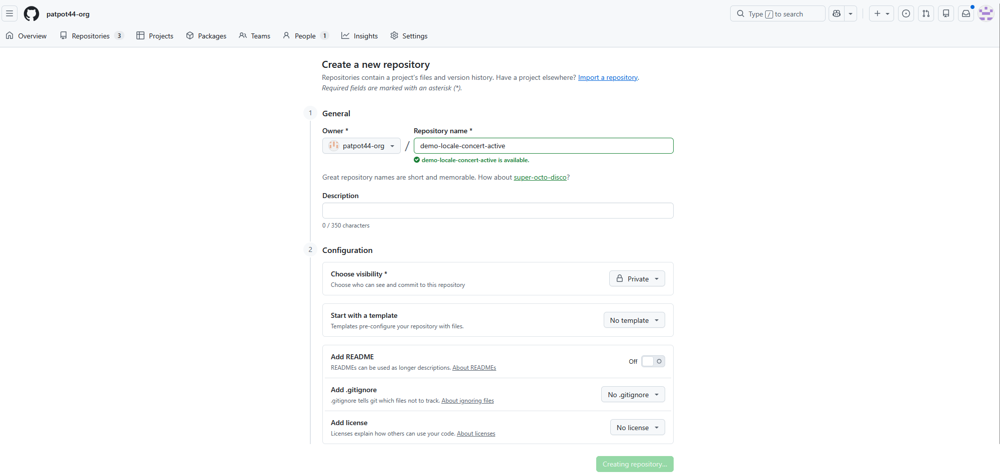
  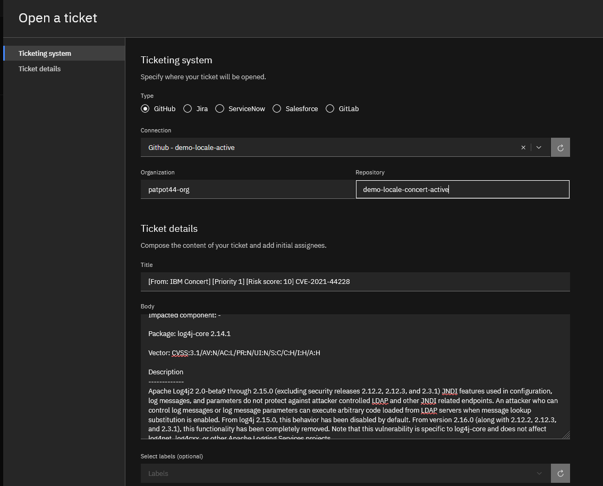

  

---

### 4. Sources de données de scan exploitées

| Source | Type | Fichier démo |
|--------|------|-------------|
| OpenSCAP 1.3.9 | Compliance OS | `05_compliance_assessment.json` |
| kube-bench 0.8.0 | Compliance Kubernetes | `05_compliance_assessment.json` |
| GitHub Advanced Security | Code SAST | `04_code_scan_sast.csv` |
| GitLab SAST (Semgrep) | Code SAST | `04_code_scan_sast.csv` |
| SonarQube | Code SAST | `04_code_scan_sast.csv` |
| Dependabot (GitHub) | Dépendances | `04_code_scan_sast.csv` |
| Trivy / Aqua Security (simulated) | Image scan | `03_image_scan.csv` |
| NVD + EPSS (NVD sync) | Metadata CVE | `02_vm_scan.csv` + `03_image_scan.csv` |

---

### 5. Évaluation des risques et des impacts

**Concert Risk Score = CVSS × EPSS × Contexte environnemental**

Exemples de la démo :
- `CVE-2024-6387` OpenSSH : CVSS 8.1 + EPSS 0.76 → Risk Score 89 (prod) vs 74 (staging)
- `CVE-2024-24786` Go Protobuf : CVSS 7.5 + EPSS 0.42 → Risk Score 61 → patch planifié non urgent
- Certificat `erp-gemini-api-mtls` : expiré depuis 13 jours + algorithme SHA-1 → Risk Critical

---

### 6. Seuil de risque → patch automatique vs action manuelle

| Risk Score | Exploit dispo | Auto-Patch | Décision |
|------------|---------------|------------|----------|
| ≥ 90 + exploit | Oui | ✅ Oui | Patch automatique immédiat |
| 70–89 + exploit | Oui | ❌ Non | Ticket ServiceNow + validation staging |
| 70–89 sans exploit | Non | ⏱ Planifié | Fenêtre maintenance prochaine |
| < 70 | N/A | ❌ Non | Backlog / planification trimestrielle |
| Faux positif | N/A | ❌ Non | Accepted Risk avec justification |

---

### 7. Workflow de patching complet

librairie workflow :
https://automation-library.ibm.com/workflows

```
Ingestion scan (VM/Image/Code)
      ↓
Concert calcule Risk Score (CVSS × EPSS × contexte)
      ↓
Gemini AI analyse exploitabilité et contexte métier
      ↓
     [Risk ≥ 90 + exploit]           [Risk 70-89]             [Risk < 70]
           ↓                               ↓                       ↓
  Patch auto déclenché           Ticket ServiceNow         Backlog sécurité
  (RHEL Patching / Windows        INC créé automatique      planification
   Patching Workflow)             + assigné au bon owner    trimestrielle
           ↓                               ↓
  Test post-patch (staging)      Review équipe sécurité
  Concert valide l'absence        ↓
  du CVE après patch             Approbation manuelle
           ↓                               ↓
  Ticket SNow fermé auto          Patch fenêtre maint.
  Concert Arena mis à jour              ↓
                                  Test staging (Concert
                                  vérifie CVE absent)
                                        ↓
                                  Déploiement prod
                                  Ticket SNow fermé
```

### 8. Workflow de patching complet

Oragization : `patpot44-org`

repositorie : `demo-locale-concert-active`

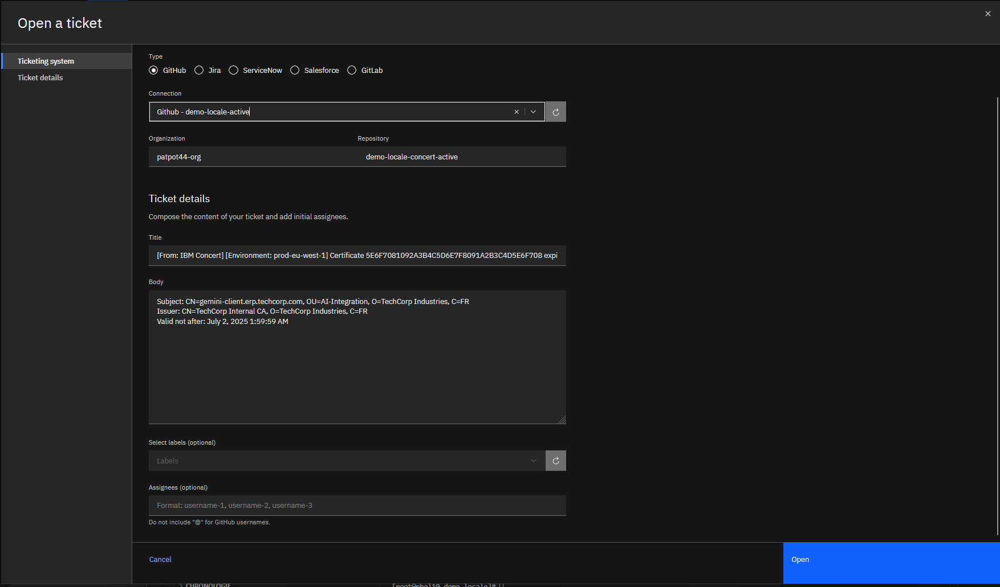

### 9-renouvellement de certificats

------

#### Renouvellement de certificat via Concert Workflows

Concert propose un **workflow préconfiguré** dédié au renouvellement automatique des certificats associés à des access points Kubernetes/OCP.

------

#### Architecture du flux

```txt
Concert (détecte expiration)
    ↓ Automation Rule
Concert Workflows
    ↓ Workflow : Discover_Public_Access_Points_From_Kubernetes_And_OCP
Cluster K8s / OCP
    ↓ Révoque l'ancien certificat + génère le nouveau
Concert (mise à jour automatique de la vue Certificates)
```


------

#### Étape 1 — Importer le workflow préconfiguré

```txt
Concert → Workflows → Create workflow → Select from library
```


Importez le workflow :

> **`Discover_Public_Access_Points_From_Kubernetes_And_OCP`**

------

#### Étape 2 — Créer les 2 authentifications requises

Depuis :

```txt
Concert Workflows → Authentications → Create
```


| Auth              | Service          | Paramètres                                            |
| ----------------- | ---------------- | ----------------------------------------------------- |
| **`concertAuth`** | Concert          | `host`, `port`, `instance_id`, `username`, `password` |
| **`k8sAuth`**     | Kubernetes / OCP | `kubeconfig` ou token Bearer + URL du cluster         |

```json
// concertAuth — Config Data
{
  "host": "172.22.147.223",
  "port": "12443",
  "instance_id": "04cb5e64-3135-4ec4-ab96-fb98c611620a",
  "username": "<concert_user>",
  "password": "<concert_password>"
}
```


> ⚠️ **Notez exactement les noms** donnés aux 2 authentifications — vous en aurez besoin à l'étape suivante.

------

#### Étape 3 — Éditer le workflow importé

```txt
Concert Workflows → Workflows → [votre workflow] → Edit
```


Dans l'éditeur, branchez les authentifications sur les nœuds correspondants :

- Nœud **Concert** → sélectionnez `concertAuth`
- Nœud **Kubernetes/OCP** → sélectionnez `k8sAuth`

------

#### Étape 4 — Exécuter (3 options)

| Option                  | Quand l'utiliser                        | Comment                                                      |
| ----------------------- | --------------------------------------- | ------------------------------------------------------------ |
| **A — Run manuel**      | Démo ponctuelle                         | `Workflows` → overflow menu → **Run**                        |
| **B — Job planifié**    | Scan récurrent (ex: toutes les 24h)     | `Workflows` → **Create job** → choisir intervalle            |
| **C — Automation Rule** | Déclenchement automatique sur condition | `Concert → Automation Rules` → condition : certificat expirant dans X jours → action : déclencher le workflow |

**Pour la démo, Option C est la plus impactante :**

```txt
Concert → Administration → Automation Rules → Create rule
  Condition : Certificate expiry ≤ 30 days
  Action    : Trigger workflow → Discover_Public_Access_Points_...
```


------

#### Étape 5 — Vérifier le résultat

```txt
Protect → Dimensions → Operations → Certificates
```


Le workflow :

1. **Révoque** l'ancien certificat expiré
2. **Génère** un nouveau certificat via le cluster K8s/OCP
3. **Pousse** le nouveau certificat dans Concert automatiquement

👉 Les certificats passent de 🔴 **Expired** à 🟢 **Valid** sans intervention manuelle.

------

> **Doc de référence :** Certificate access point renewal — Concert 3.0.x
>
> **Prérequis :** Concert et Concert Workflows doivent être déployés (SaaS ou on-premises), et le cluster Kubernetes/OCP doit être accessible depuis Concert Workflows.

### 10-Resilience

#### Etape 2 — Créer un Resilience Profile

```txt
Resilience → Profiles → Create profile
```


- **Name** : `techcorp-erp-profile`
- **Library** : sélectionner la library par défaut
- **Requirements** : cocher ceux pertinents (ex: Availability, Security, Recoverability)
- **Scoring logic** : définir les poids par catégorie

> 💡 Vous pouvez aussi **cloner un profil existant** si la library en propose.

------

#### Étape 3 — Créer un Posture Plan

```txt
Resilience → Posture plans → Create posture plan
```


- **Application** : `techcorp-erp` (doit être dans l'inventaire)
- **Profile** : `techcorp-erp-profile`
- **Aggregation period** : `Daily` (recommandé pour la démo)

------

#### Étape 4 — Injecter les données (3 options)

##### Option A — Saisie manuelle (la plus rapide pour la démo)

```txt
Resilience → Posture plans → [votre plan] → Create assessment
```


Saisissez directement les valeurs dans l'UI :

| Métrique                                    | Valeur démo |
| ------------------------------------------- | ----------- |
| `pct_availability_by_downtime`              | `99.5`      |
| `mins_mttr_sev1`                            | `45`        |
| `mins_mttr_sev2`                            | `120`       |
| `pct_incidents_detected_by_monitoring`      | `78`        |
| `pct_sev1_incidents_detected_by_monitoring` | `92`        |

##### Option B — Via API Concert

```bash
CONCERT_HOST="https://172.22.147.223:12443"
API_KEY="C_API_KEY aWJtY29uY2VydDo0Y2Y1ZmFhYi04ZDEwLTRlNTEtOTZlYS1kNjUzY2QyM2QyOGM="
INSTANCE_ID="04cb5e64-3135-4ec4-ab96-fb98c611620a"
POSTURE_PLAN_ID="<id_du_posture_plan>"

curl -sk -X POST \
  "${CONCERT_HOST}/concert-resilience/api/v1/postures/${POSTURE_PLAN_ID}/evaluate" \
  -H "Authorization: ${API_KEY}" \
  -H "InstanceID: ${INSTANCE_ID}" \
  -H "Content-Type: application/json" \
  -d '{
    "metrics": {
      "pct_availability_by_downtime_post_rca": 99.5,
      "mins_mttr_sev1": 45,
      "mins_mttr_sev2": 120,
      "pct_incidents_detected_by_monitoring": 78,
      "pct_sev1_incidents_detected_by_monitoring": 92,
      "pct_sev2_incidents_detected_by_monitoring": 85
    }
  }'
```


##### Option C — Via Concert Workflows (intégration externe)

Sources supportées pour l'ingestion automatique :

| Source                | Métriques importées            |
| --------------------- | ------------------------------ |
| **ServiceNow**        | MTTR, disponibilité, incidents |
| **Datadog**           | métriques d'observabilité      |
| **Hybrid Cloud Mesh** | topologie réseau               |
| **ServiceNow APM**    | topologie applicative          |

```txt
Workflows → Create workflow → Select from library
→ importer le workflow correspondant à votre source
```


------

#### Étape 5 — Voir le score et les actions

Après l'assessment :

```txt
Resilience → dashboard
```


👉 Le **score 0/100 monte**, les tuiles *"No available actions"* se peuplent de recommandations dans les 4 catégories : **Critical actions**, **Availability issues**, **Security issues**, **Missing metrics**.

------

> **Recommandation pour la démo :** commencez par l'**Option A** (saisie manuelle) — c'est immédiat, ne nécessite aucune intégration externe, et génère un score visible en moins de 2 minutes. Ensuite montrez l'**Option C** (Workflows + ServiceNow/Datadog) comme la version "production automatisée".

____

#### Resilience Overview

Resilience in IBM Concert refers to an  application deployment's ability to continue operating during  disruptions, efficiently recover from failures, and maintain expected  service levels over time. IBM Concert offers capabilities to assess  deployment resilience, evaluate operational risk, generate resilience  scores, and improve system reliability. This is achieved by evaluating  deployments against defined requirements, identifying risks, and  recommending actions to address identified gaps.

#### Resilience Measurement

Resilience is measured using predefined  libraries of requirements, profiles that set target scores and  thresholds, posture management to apply profiles, and scoring systems  that aggregate metric data into an overall resilience score ranging from 0 to 100. This comprehensive approach ensures that deployments are  evaluated thoroughly and effectively.

#### Key Components

1. **Requirements Libraries**:  These contain predefined criteria against which deployments are  assessed. They form the basis for evaluating the resilience and  reliability of an application deployment.
2. **Profiles**: Profiles define  target scores and thresholds for resilience. They are used to benchmark  and compare the performance and robustness of deployments.
3. **Posture Management**: This  component allows users to apply specific profiles to different  deployments, ensuring consistent assessment and management of resilience across different environments.
4. **Scoring System**: The scoring system aggregates data from various metrics to produce an overall  resilience score. This score provides a clear, quantitative measure of a deployment's resilience.

##### Resilience Assessment Process

1. **Requirement Evaluation**:  Deployments are evaluated against the predefined requirements in the  libraries. This step identifies areas where the deployment meets or  falls short of resilience criteria.
2. **Risk Identification**: The  process involves identifying operational risks that could impact the  deployment's ability to perform reliably. This includes recognizing  potential failure points and vulnerabilities.
3. **Scoring**: Based on the  evaluation and risk identification, IBM Concert generates a resilience  score. This score is an aggregate of all the collected metric data and  provides a numerical representation of the deployment's resilience.

#### Benefits of Resilience Management

Using IBM Concert for resilience  management offers several benefits, including the ability to proactively identify and mitigate risks, maintain high service levels, and ensure  that deployments can recover quickly and efficiently from failures. By  leveraging the tools and frameworks provided by IBM Concert,  organizations can significantly enhance the reliability and resilience  of their application deployments.

Do you want to learn how to set up resilience assessments for your Ecommerce-app?

​     

### 11- Compliance


####  Compliance Mappings — Ce que l'on peut démontrer

#### 🔍 Concept clé

Le **Compliance Mapping** permet de **traduire une posture de conformité d'un référentiel vers un autre** sans refaire les évaluations from scratch. C'est la fonctionnalité "pont inter-standards".

------

##### 🎯 Ce que vous pouvez montrer en démo

##### 1. **Créer un nouveau mapping (bouton "Add mapping")**

- Démontrer qu'on peut créer un mapping entre deux catalogues déjà chargés (ex. **NIST 800-53 → PCI DSS**, **CIS Controls → ISO 27001**, etc.)
- Nommer le mapping, choisir un **catalogue source** et un **catalogue cible**
- Uploader un fichier de logique de mapping au format **OSCAL** (JSON)

##### 2. **Valeur business à mettre en avant**

- ♻️ **Réutilisation** : "On a déjà fait nos évaluations NIST. Plutôt que de tout recommencer pour PCI DSS, on mappe les contrôles équivalents"
- ⚡ **Gain de temps** : Élimination des évaluations en double pour des référentiels ayant des recouvrements (NIST / ISO / CIS / PCI DSS partagent beaucoup de contrôles)
- 🌍 **Multi-standards** : Une organisation soumise à plusieurs réglementations (ex. banque : **DORA + PCI DSS + NIS2**) peut dériver sa posture sur tous les frameworks depuis un seul scan
- 🔧 **Custom** : Possibilité d'uploader ses propres fichiers de mapping pour des catalogues propriétaires ou sectoriels

##### 3. Architecture de la démonstration possible

| Élément                | Contenu                                                      |
| ---------------------- | ------------------------------------------------------------ |
| **Catalogue source**   | NIST 800-53 Rev5 (déjà chargé dans Standard catalogs)        |
| **Catalogue cible**    | PCI DSS v4.0 (déjà chargé)                                   |
| **Fichier de mapping** | Fichier OSCAL JSON téléchargeable depuis Concert public GitHub |
| **Résultat attendu**   | Apparition du mapping dans la liste avec nom, version, source/target et date |

##### 4. **Format technique (pour audience technique)**

- Le fichier de mapping est au format **OSCAL** (Open Security Controls Assessment Language — standard NIST)
- C'est une représentation machine-readable des correspondances entre contrôles de deux frameworks
- IBM Concert supporte aussi bien les mappings fournis en standard que les **mappings personnalisés uploadés**

------

##### ⚠️ Limites à anticiper pour la démo

- L'écran montré est **vide (0 mappings)** — il faudra en créer un en live ou avoir un environnement pré-rempli
- Les catalogues source et cible doivent déjà être présents dans l'onglet **Standard catalogs** (vous en avez 6 chargés, visible dans la capture)
- La qualité du résultat dépend de la complétude du fichier de mapping OSCAL uploadé

------

##### 💡 Pitch de démo suggéré

> *"Imaginez que votre équipe a passé 3 mois à évaluer vos contrôles NIST 800-53. Vous devez maintenant passer un audit PCI DSS. Avec le Compliance Mapping, Concert traduit automatiquement votre posture NIST en équivalents PCI DSS — vous identifiez immédiatement les gaps sans repartir de zéro."*               

---

## CVEs marquants pour la démo (top 5)

| CVE | CVSS | Risk Score | Impact démo |
|-----|------|------------|-------------|
| CVE-2024-3094 XZ Backdoor | 10.0 | 99 | Supply chain — Gemini détecte, patch immédiat |
| CVE-2024-47176 CUPS RCE | 9.9 | 98 | Auto-patch VM → SNow ticket auto |
| CVE-2021-44228 Log4Shell | 10.0 | 99 | Code scan GitHub → PR auto + patch |
| cis-k8s-1.2.1 API anonyme | Critical | Critical | Compliance → SNow + Gemini URGENT |
| cert erp-gemini-api-mtls | — | Critical | Certificat expiré → intégration IA coupée |


#### commande pour résoudre l'upload de `05_compliance`

```
# Récupérer les contrôles du catalogue et du profil k8s-cis-1.23
foreach ($endpoint in @(
    "/compliance/api/v1/catalogs/7f3a4a3f-70d7-48a8-b706-8aa3fb5230fb/controls?page_size=20",
    "/compliance/api/v1/profiles/3dc9abe6-d107-48e0-b659-2f62992cca76/controls?page_size=20",
    "/compliance/api/v1/profiles/3dc9abe6-d107-48e0-b659-2f62992cca76"
)) {
    $req = [System.Net.HttpWebRequest]::Create("$baseUrl$endpoint")
    $req.Method = "GET"
    $req.Headers.Add("Authorization", $authHeader)
    $req.Headers.Add("InstanceID", "0000-0000-0000-0000")
    try {
        $resp = $req.GetResponse()
        $reader = New-Object System.IO.StreamReader($resp.GetResponseStream())
        $body = $reader.ReadToEnd()
        Write-Host "=== $endpoint (OK) ===" 
        Write-Host $body.Substring(0, [Math]::Min(2000, $body.Length))
        Write-Host "..."
    } catch [System.Net.WebException] {
        $code = $_.Exception.Response.StatusCode
        $errReader = New-Object System.IO.StreamReader($_.Exception.Response.GetResponseStream())
        Write-Host "=== $endpoint => $code : $($errReader.ReadToEnd()) ==="
    }
}
```


```
$ Add-Type @" using System.Net; using System.Security.Cryptography.X509Certificates; public class TrustAllCerts4 : ICertificatePolicy { public bool CheckValidationResult(ServicePoint sp, X509Certificate cert, WebRequest req, int problem) { return true; } } "@ [System.Net.ServicePointManager]::CertificatePolicy = New-Object TrustAllCerts4 [System.Net.ServicePointManager]::SecurityProtocol = [System.Net.SecurityProtocolType]::Tls12 $baseUrl = "https://172.22.147.223:12443" $authHeader = "C_API_KEY aWJtY29uY2VydDo0Y2Y1ZmFhYi04ZDEwLTRlNTEtOTZlYS1kNjUzY2QyM2QyOGM=" # Tester plusieurs endpoints possibles pour compliance foreach ($endpoint in @( "/compliance/api/v1/profiles", "/compliance/api/v1/catalogs", "/compliance/api/v1/postures", "/concert/api/v1/profiles", "/concert/api/v1/catalogs", "/protect/api/v1/profiles", "/protect/api/v1/catalogs" )) { $req = [System.Net.HttpWebRequest]::Create("$baseUrl$endpoint") $req.Method = "GET" $req.Headers.Add("Authorization", $authHeader) $req.Headers.Add("InstanceID", "0000-0000-0000-0000") try { $resp = $req.GetResponse() $reader = New-Object System.IO.StreamReader($resp.GetResponseStream()) $body = $reader.ReadToEnd() Write-Host "=== $endpoint (OK) ===" Write-Host ($body | Select-Object -First 500) } catch [System.Net.WebException] { $code = $_.Exception.Response.StatusCode Write-Host "=== $endpoint => $code ===" } }
=== /compliance/api/v1/profiles (OK) ===
{"data":[{"uuid":"3dc9abe6-d107-48e0-b659-2f62992cca76","catalog_ids":["7f3a4a3f-70d7-48a8-b706-8aa3fb5230fb"],"catalog_names":["Kubernetes Catalog"],"title":"k8s-cis-1.23","description":"CIS Benchmark for Kubernetes v1.23","version":"1.23","last_updated_by":"ibmconcert","last_updated_on":1787811361,"sample_data_upload":false,"mapped_profile":false,"allow_manual_assessment":false,"is_default":false,"user_app_role":"admin","application_ids":["24944671-7b0d-4ceb-9fe4-fa7b7f5e18f6"]},{"uuid":"ada71c7d-5bf7-4b2a-b65d-24bbc988c70b","catalog_ids":["7f3a4a3f-70d7-48a8-b706-8aa3fb5230fb"],"catalog_names":["Kubernetes Catalog"],"title":"Kubernetes Profile","description":"A profile of compliance controls for assessing the security and configuration of Kubernetes and OpenShift platforms.","version":"1.0.0","last_updated_by":"system","last_updated_on":1787617392,"sample_data_upload":false,"mapped_profile":false,"allow_manual_assessment":false,"is_default":true,"user_app_role":"viewer"}],"pagination":{"total_count":2,"total_pages":1,"page_size":25,"page_number":1}}

=== /compliance/api/v1/catalogs (OK) ===
{"data":[{"uuid":"7f3a4a3f-70d7-48a8-b706-8aa3fb5230fb","title":"Kubernetes Catalog","tags":[],"published_date":"2025-10-28T00:00:00Z","version":"1.0.0","description":"A catalog of compliance controls for assessing the security and configuration of Kubernetes and OpenShift platforms.","last_updated_by":"system","last_updated_on":1787617392,"component_definitions":[{"component_definition_id":"88cb105b-a46b-4fd2-9ee6-926e725fe241","component_definition_title":"Kube Component","component_definition_version":"1.0.0","source":"","validators":[{"validator_id":"54e423db-9617-44e6-be81-46dd0f98ceae","scanner_name":"kube scan","scanner_version":"1.0.0","source":"","benchmark":"kubesystem","description":"kube scan","additional_validator_payload":null,"last_updated_by":"system","last_updated_on":1787617392}]}],"sample_data_upload":false,"agent_metadata":null,"ciso_ai_agent_status":"","draft_catalog":false,"is_ai_generated_catalog":false,"is_default":true,"region":"Global","standard_type":"","industry_domain":""}],"pagination":{"total_count":1,"total_pages":1,"page_size":25,"page_number":1},"available_filters":{"region":[],"standard_type":[],"industry_domain":[],"tags":[]}}

=== /compliance/api/v1/postures (OK) ===
[]

=== /concert/api/v1/profiles => NotFound ===
=== /concert/api/v1/catalogs => NotFound ===
=== /protect/api/v1/profiles => NotFound ===
=== /protect/api/v1/catalogs => NotFound ===


Excellent ! Voilà les informations clés :

Profils existants dans Concert :

UUID	Titre	Catalogue
3dc9abe6-...	k8s-cis-1.23	Kubernetes Catalog
ada71c7d-...	Kubernetes Profile (default)	Kubernetes Catalog
Catalogue :

7f3a4a3f-... → Kubernetes Catalog avec scanner kube scan / benchmark kubesystem
Le problème est clair : notre fichier OSCAL utilise "profile-id": "k8s-cis-1.23" — le profil existe ! Mais les control-ids (KSV001, etc.) ne correspondent pas aux contrôles du catalogue. Récupérons les vrais control-ids du catalogue :
```


```
$ Add-Type @" using System.Net; using System.Security.Cryptography.X509Certificates; public class TrustAllCerts4 : ICertificatePolicy { public bool CheckValidationResult(ServicePoint sp, X509Certificate cert, WebRequest req, int problem) { return true; } } "@ [System.Net.ServicePointManager]::CertificatePolicy = New-Object TrustAllCerts4 [System.Net.ServicePointManager]::SecurityProtocol = [System.Net.SecurityProtocolType]::Tls12 
$baseUrl = "https://172.22.147.223:12443" 
$authHeader = "C_API_KEY aWJtY29uY2VydDo0Y2Y1ZmFhYi04ZDEwLTRlNTEtOTZlYS1kNjUzY2QyM2QyOGM=" # Tester plusieurs endpoints possibles pour compliance 
foreach ($endpoint in @( "/compliance/api/v1/profiles", "/compliance/api/v1/catalogs", "/compliance/api/v1/postures", "/concert/api/v1/profiles", "/concert/api/v1/catalogs", "/protect/api/v1/profiles", "/protect/api/v1/catalogs" )) 
{ $req = [System.Net.HttpWebRequest]::Create("$baseUrl$endpoint") $req.Method = "GET" $req.Headers.Add("Authorization", $authHeader) $req.Headers.Add("InstanceID", "0000-0000-0000-0000") try { $resp = $req.GetResponse() $reader = New-Object System.IO.StreamReader($resp.GetResponseStream()) $body = $reader.ReadToEnd() Write-Host "=== $endpoint (OK) ===" Write-Host ($body | Select-Object -First 500) } catch [System.Net.WebException] { $code = $_.Exception.Response.StatusCode Write-Host "=== $endpoint => $code ===" } }
=== /compliance/api/v1/profiles (OK) ===
{"data":[{"uuid":"3dc9abe6-d107-48e0-b659-2f62992cca76","catalog_ids":["7f3a4a3f-70d7-48a8-b706-8aa3fb5230fb"],"catalog_names":["Kubernetes Catalog"],"title":"k8s-cis-1.23","description":"CIS Benchmark for Kubernetes v1.23","version":"1.23","last_updated_by":"ibmconcert","last_updated_on":1787811361,"sample_data_upload":false,"mapped_profile":false,"allow_manual_assessment":false,"is_default":false,"user_app_role":"admin","application_ids":["24944671-7b0d-4ceb-9fe4-fa7b7f5e18f6"]},{"uuid":"ada71c7d-5bf7-4b2a-b65d-24bbc988c70b","catalog_ids":["7f3a4a3f-70d7-48a8-b706-8aa3fb5230fb"],"catalog_names":["Kubernetes Catalog"],"title":"Kubernetes Profile","description":"A profile of compliance controls for assessing the security and configuration of Kubernetes and OpenShift platforms.","version":"1.0.0","last_updated_by":"system","last_updated_on":1787617392,"sample_data_upload":false,"mapped_profile":false,"allow_manual_assessment":false,"is_default":true,"user_app_role":"viewer"}],"pagination":{"total_count":2,"total_pages":1,"page_size":25,"page_number":1}}

=== /compliance/api/v1/catalogs (OK) ===
{"data":[{"uuid":"7f3a4a3f-70d7-48a8-b706-8aa3fb5230fb","title":"Kubernetes Catalog","tags":[],"published_date":"2025-10-28T00:00:00Z","version":"1.0.0","description":"A catalog of compliance controls for assessing the security and configuration of Kubernetes and OpenShift platforms.","last_updated_by":"system","last_updated_on":1787617392,"component_definitions":[{"component_definition_id":"88cb105b-a46b-4fd2-9ee6-926e725fe241","component_definition_title":"Kube Component","component_definition_version":"1.0.0","source":"","validators":[{"validator_id":"54e423db-9617-44e6-be81-46dd0f98ceae","scanner_name":"kube scan","scanner_version":"1.0.0","source":"","benchmark":"kubesystem","description":"kube scan","additional_validator_payload":null,"last_updated_by":"system","last_updated_on":1787617392}]}],"sample_data_upload":false,"agent_metadata":null,"ciso_ai_agent_status":"","draft_catalog":false,"is_ai_generated_catalog":false,"is_default":true,"region":"Global","standard_type":"","industry_domain":""}],"pagination":{"total_count":1,"total_pages":1,"page_size":25,"page_number":1},"available_filters":{"region":[],"standard_type":[],"industry_domain":[],"tags":[]}}

=== /compliance/api/v1/postures (OK) ===
[]

=== /concert/api/v1/profiles => NotFound ===
=== /concert/api/v1/catalogs => NotFound ===
=== /protect/api/v1/profiles => NotFound ===
=== /protect/api/v1/catalogs => NotFound ===
```


Excellent ! Voilà les informations clés :

**Profils existants dans Concert :**

| UUID           | Titre                              | Catalogue          |
| -------------- | ---------------------------------- | ------------------ |
| `3dc9abe6-...` | **`k8s-cis-1.23`**                 | Kubernetes Catalog |
| `ada71c7d-...` | **`Kubernetes Profile`** (default) | Kubernetes Catalog |

**Catalogue :**

- `7f3a4a3f-...` → **Kubernetes Catalog** avec scanner `kube scan` / benchmark `kubesystem`

Le problème est clair : notre fichier OSCAL utilise `"profile-id": "k8s-cis-1.23"` — le profil existe ! Mais les `control-ids` (`KSV001`, etc.) ne correspondent pas aux contrôles du catalogue. Récupérons les vrais control-ids du catalogue :


## Comment montrer l'automatisation du patching dans IBM Concert

La fonctionnalité s'appelle **Auto-remediation** dans Concert Workflows. Elle couvre tout le cycle : détection → approbation → patch → mise à jour du statut.

------

### Les 3 workflows qui forment le pipeline complet

```txt
Concert détecte le CVE
       │
       ▼
1. Create_Change_Request_For_Remediation_Action
   → Crée automatiquement une PR GitHub ou un incident ServiceNow
       │
       ▼ (après approbation humaine)
2. Monitor_Remediation_Action_Status
   → Surveille le statut d'approbation dans l'outil externe
   → Planifie la fenêtre de maintenance
       │
       ▼
3. Remediation_Master
   → Applique le patch SSH sur le VM cible (RHEL, Windows, Ubuntu, Tomcat…)
   → Met à jour le statut de l'action dans l'UI Concert
```


------

### Étapes concrètes pour la démo TechCorp ERP (RHEL 8.9)

#### Étape 1 — Prérequis

- Concert Workflows installé et connecté à Concert
- Connexion **GitHub** configurée (pour les PR d'approbation)
- Connexion **SSH** configurée (pour atteindre les VMs RHEL)

#### Étape 2 — Importer les 3 workflows depuis l'IBM Automation Library

Dans **Concert Workflows** :

```txt
Workflows → Create workflow → Select from library
```


Importer :

- `Create_Change_Request_For_Remediation_Action`
- `Monitor_Remediation_Action_Status`
- `Remediation_Master`

> 💡 Conseil : créer un dossier `Remediation` dans Concert Workflows pour les regrouper.

#### Étape 3 — Les cibles supportées par `Remediation_Master`

| OS / Composant          | Mécanisme de patch             |
| ----------------------- | ------------------------------ |
| **RHEL** (cas TechCorp) | `yum update <package>` via SSH |
| **Ubuntu**              | `apt-get upgrade` via SSH      |
| **Amazon Linux**        | `yum/dnf update` via SSH       |
| **Windows**             | Windows Update via WinRM       |
| **Apache Tomcat**       | Upgrade de version via SSH     |
| **Docker Hub images**   | Pull de la nouvelle image      |

#### Étape 4 — Configurer un job planifié

Les 3 workflows s'exécutent automatiquement à interval configuré (ex. toutes les heures pour le monitoring d'approbation).

------

### Scénario de démo recommandé

1. **Aller dans** `Dimensions > Vulnerability > CVEs` → les CVEs du fichier `02_vm_scan.csv` (RHEL 8.9) sont listées avec leurs actions suggérées
2. **Cliquer sur une action** (ex. patch de `openssl` CVE-2024-xxxx) → Concert a déjà créé la PR GitHub
3. **Montrer la PR GitHub** générée automatiquement avec le détail du patch
4. **Approuver la PR** → `Monitor_Remediation_Action_Status` détecte l'approbation
5. **Le patch s'applique** sur le VM cible via `Remediation_Master` (SSH `yum update openssl`)
6. **Le statut passe à `Resolved`** dans l'UI Concert automatiquement

------

### Ce qui manque dans le démo locale actuel

Le démo actuel n'a **pas de workflow de patching** — uniquement le workflow CISO Assessment et les scans compliance. Pour montrer l'auto-remediation, il faut :

| Manque                        | Solution                                                     |
| ----------------------------- | ------------------------------------------------------------ |
| Workflow `Remediation_Master` | Importer depuis l'IBM Automation Library dans Concert Workflows |
| Connexion SSH vers un VM RHEL | Configurer une auth SSH dans Concert Workflows (même un VM local/Vagrant suffira) |
| Connexion GitHub pour les PR  | Déjà documenté dans le README (token PAT)                    |

> **Raccourci démo sans VM réel** : on peut montrer le workflow en mode "dry run" ou simplement montrer l'UI Concert avec les **Remediation Actions** générées après import du `02_vm_scan.csv`, sans exécuter réellement le patch — Concert affiche déjà les actions recommandées et leur statut d'approbation.

La documentation de référence : Auto-remediation using Concert Workflows

https://www.ibm.com/docs/en/concert/2.3.x?topic=vulnerability-auto-remediation-using-concert-workflows

## Secure Coder

https://www.ibm.com/docs/fr/concert/3.0.x?topic=coder-access-secure

### pour activer :

```
curl -k -X PATCH \
  "https://<CONCERT_HOST>/concert/core/api/v1/instance_settings" \
  -H "Authorization: <your_authorization_value>" \
  -H "InstanceId: <INSTANCE_ID>" \
  -H "Content-Type: application/json" \
  -d '{
    "instance_settings": [{
      "object_type": "secure_coder",
      "settings": {
        "enabled": true,
        "code_retention_minutes": <time_in_minutes_for_code_retention>
      }
    }]
  }'
```

```
curl -sk -X PATCH 'https://172.22.147.223:12443/concert/core/api/v1/instance_settings' -H 'Authorization: C_API_KEY aWJtY29uY2VydDo0Y2Y1ZmFhYi04ZDEwLTRlNTEtOTZlYS1kNjUzY2QyM2QyOGM=' -H 'InstanceId: 0000-0000-0000-0000' -H 'Content-Type: application/json' -d '{\"instance_settings\": [{\"object_type\": \"secure_coder\", \"settings\": {\"enabled\": true, \"code_retention_minutes\": 60}}]}'
```


```
curl -k -X PATCH \
  "https://172.22.147.223:12443/concert/core/api/v1/instance_settings" \
  -H "Authorization: C_API_KEY aWJtY29uY2VydDo0Y2Y1ZmFhYi04ZDEwLTRlNTEtOTZlYS1kNjUzY2QyM2QyOGM=" \
  -H "InstanceId: 0000-0000-0000-0000" \
  -H "Content-Type: application/json" \
  -d '{
    "instance_settings": [{
      "object_type": "secure_coder",
      "settings": {
        "enabled": true,
        "code_retention_minutes": 60
      }
    }]
  }'
```

#### ok :

```
curl -k -X PATCH \
  "https://172.22.147.223:12443/concert/core/api/v1/instance_settings" \
  -H "Authorization: C_API_KEY aWJtY29uY2VydDo0Y2Y1ZmFhYi04ZDEwLTRlNTEtOTZlYS1kNjUzY2QyM2QyOGM=" \
  -H "InstanceId: 0000-0000-0000-0000" \
  -H "Content-Type: application/json" \
  -d '{
    "instance_settings": [{
      "object_type": "secure_coder",
      "settings": {
        "enabled": true,
        "code_retention_minutes": 1440
      }
    }]
  }'
  
  
  {"instance_settings":[{"id":"04cb5e64-3135-4ec4-ab96-fb98c611620a","object_type":"vulnerability","settings":{"priority_settings":{"priority1":7.5,"priority2":5,"priority3":2.5},"licenses":[],"priority_mappings":{"priority_1":[],"priority_2":[],"priority_3":[],"deprioritized":[]},"score_type":"risk_score","enable_vulnerability_scoring":false,"enable_goal_evaluation":false,"external_score_status":"disabled","sample_tour_enabled":false,"enable_concert_risk_scoring":false,"enabled":false,"timeout":{},"certificate_policies":{"certificate_expiry_threshold":0,"known_issuer":null,"allowed_hash_algorithms":null,"domain":null,"subdomain":null,"ports":null},"risk_benchmarks":{"assessment":{},"remediation":{},"constants":{}},"timeout_settings":null}},{"id":"0470d39a-3e02-4bff-82cf-676d522c1554","object_type":"license","settings":{"priority_settings":{"priority1":0,"priority2":0,"priority3":0},"licenses":[{"description":"BSD Zero Clause License","id":"0BSD","acceptable":true},{"description":"Apache License 1.0","id":"Apache-1.0","acceptable":true},{"description":"Apache License 1.1","id":"Apache-1.1","acceptable":true},{"description":"Apache License 2.0","id":"Apache-2.0","acceptable":true},{"description":"BSD 1-Clause License","id":"BSD-1-Clause","acceptable":true},{"description":"BSD 2-Clause \"Simplified\" License","id":"BSD-2-Clause","acceptable":true},{"description":"BSD 2-Clause - Ian Darwin variant","id":"BSD-2-Clause-Darwin","acceptable":true},{"description":"BSD 2-Clause - first lines requirement","id":"BSD-2-Clause-first-lines","acceptable":true},{"description":"BSD 2-Clause FreeBSD License","id":"BSD-2-Clause-FreeBSD","acceptable":true},{"description":"BSD 2-Clause NetBSD License","id":"BSD-2-Clause-NetBSD","acceptable":true},{"description":"BSD-2-Clause Plus Patent License","id":"BSD-2-Clause-Patent","acceptable":true},{"description":"BSD 2-Clause with views sentence","id":"BSD-2-Clause-Views","acceptable":true},{"description":"BSD 3-Clause \"New\" or \"Revised\" License","id":"BSD-3-Clause","acceptable":true},{"description":"BSD 3-Clause acpica variant","id":"BSD-3-Clause-acpica","acceptable":true},{"description":"BSD with attribution","id":"BSD-3-Clause-Attribution","acceptable":true},{"description":"BSD 3-Clause Clear License","id":"BSD-3-Clause-Clear","acceptable":true},{"description":"BSD 3-Clause Flex variant","id":"BSD-3-Clause-flex","acceptable":true},{"description":"Hewlett-Packard BSD variant license","id":"BSD-3-Clause-HP","acceptable":true},{"description":"Lawrence Berkeley National Labs BSD variant license","id":"BSD-3-Clause-LBNL","acceptable":true},{"description":"BSD 3-Clause Modification","id":"BSD-3-Clause-Modification","acceptable":true},{"description":"BSD 3-Clause No Military License","id":"BSD-3-Clause-No-Military-License","acceptable":true},{"description":"BSD 3-Clause No Nuclear License","id":"BSD-3-Clause-No-Nuclear-License","acceptable":true},{"description":"BSD 3-Clause No Nuclear License 2014","id":"BSD-3-Clause-No-Nuclear-License-2014","acceptable":true},{"description":"BSD 3-Clause No Nuclear Warranty","id":"BSD-3-Clause-No-Nuclear-Warranty","acceptable":true},{"description":"BSD 3-Clause Open MPI variant","id":"BSD-3-Clause-Open-MPI","acceptable":true},{"description":"BSD 3-Clause Sun Microsystems","id":"BSD-3-Clause-Sun","acceptable":true},{"description":"BSD 4-Clause \"Original\" or \"Old\" License","id":"BSD-4-Clause","acceptable":true},{"description":"BSD 4 Clause Shortened","id":"BSD-4-Clause-Shortened","acceptable":true},{"description":"BSD-4-Clause (University of California-Specific)","id":"BSD-4-Clause-UC","acceptable":true},{"description":"BSD 4.3 RENO License","id":"BSD-4.3RENO","acceptable":true},{"description":"BSD 4.3 TAHOE License","id":"BSD-4.3TAHOE","acceptable":true},{"description":"BSD Advertising Acknowledgement License","id":"BSD-Advertising-Acknowledgement","acceptable":true},{"description":"BSD with Attribution and HPND disclaimer","id":"BSD-Attribution-HPND-disclaimer","acceptable":true},{"description":"BSD-Inferno-Nettverk","id":"BSD-Inferno-Nettverk","acceptable":true},{"description":"BSD Protection License","id":"BSD-Protection","acceptable":true},{"description":"BSD Source Code Attribution - beginning of file variant","id":"BSD-Source-beginning-file","acceptable":true},{"description":"BSD Source Code Attribution","id":"BSD-Source-Code","acceptable":true},{"description":"Systemics BSD variant license","id":"BSD-Systemics","acceptable":true},{"description":"Systemics W3Works BSD variant license","id":"BSD-Systemics-W3Works","acceptable":true},{"description":"bzip2 and libbzip2 License v1.0.5","id":"bzip2-1.0.5","acceptable":true},{"description":"bzip2 and libbzip2 License v1.0.6","id":"bzip2-1.0.6","acceptable":true},{"description":"curl License","id":"curl","acceptable":true},{"description":"GNU General Public License v1.0 only","id":"GPL-1.0","acceptable":true},{"description":"GNU General Public License v1.0 or later","id":"GPL-1.0+","acceptable":true},{"description":"GNU General Public License v1.0 only","id":"GPL-1.0-only","acceptable":true},{"description":"GNU General Public License v1.0 or later","id":"GPL-1.0-or-later","acceptable":true},{"description":"GNU General Public License v2.0 only","id":"GPL-2.0","acceptable":true},{"description":"GNU General Public License v2.0 or later","id":"GPL-2.0+","acceptable":true},{"description":"GNU General Public License v2.0 only","id":"GPL-2.0-only","acceptable":true},{"description":"GNU General Public License v2.0 or later","id":"GPL-2.0-or-later","acceptable":true},{"description":"GNU General Public License v2.0 w/Autoconf exception","id":"GPL-2.0-with-autoconf-exception","acceptable":true},{"description":"GNU General Public License v2.0 w/Bison exception","id":"GPL-2.0-with-bison-exception","acceptable":true},{"description":"GNU General Public License v2.0 w/Classpath exception","id":"GPL-2.0-with-classpath-exception","acceptable":true},{"description":"GNU General Public License v2.0 w/Font exception","id":"GPL-2.0-with-font-exception","acceptable":true},{"description":"GNU General Public License v2.0 w/GCC Runtime Library exception","id":"GPL-2.0-with-GCC-exception","acceptable":true},{"description":"GNU General Public License v3.0 only","id":"GPL-3.0","acceptable":true},{"description":"GNU General Public License v3.0 or later","id":"GPL-3.0+","acceptable":true},{"description":"GNU General Public License v3.0 only","id":"GPL-3.0-only","acceptable":true},{"description":"GNU General Public License v3.0 or later","id":"GPL-3.0-or-later","acceptable":true},{"description":"GNU General Public License v3.0 w/Autoconf exception","id":"GPL-3.0-with-autoconf-exception","acceptable":true},{"description":"GNU General Public License v3.0 w/GCC Runtime Library exception","id":"GPL-3.0-with-GCC-exception","acceptable":true},{"description":"GNU Library General Public License v2 only","id":"LGPL-2.0","acceptable":true},{"description":"GNU Library General Public License v2 or later","id":"LGPL-2.0+","acceptable":true},{"description":"GNU Library General Public License v2 only","id":"LGPL-2.0-only","acceptable":true},{"description":"GNU Library General Public License v2 or later","id":"LGPL-2.0-or-later","acceptable":true},{"description":"GNU Lesser General Public License v2.1 only","id":"LGPL-2.1","acceptable":true},{"description":"GNU Lesser General Public License v2.1 or later","id":"LGPL-2.1+","acceptable":true},{"description":"GNU Lesser General Public License v2.1 only","id":"LGPL-2.1-only","acceptable":true},{"description":"GNU Lesser General Public License v2.1 or later","id":"LGPL-2.1-or-later","acceptable":true},{"description":"GNU Lesser General Public License v3.0 only","id":"LGPL-3.0","acceptable":true},{"description":"GNU Lesser General Public License v3.0 or later","id":"LGPL-3.0+","acceptable":true},{"description":"GNU Lesser General Public License v3.0 only","id":"LGPL-3.0-only","acceptable":true},{"description":"GNU Lesser General Public License v3.0 or later","id":"LGPL-3.0-or-later","acceptable":true},{"description":"Lesser General Public License For Linguistic Resources","id":"LGPLLR","acceptable":true},{"description":"MIT License","id":"MIT","acceptable":true},{"description":"Python Software Foundation License 2.0","id":"PSF-2.0","acceptable":true},{"description":"Vim License","id":"Vim","acceptable":true},{"description":"X11 License","id":"X11","acceptable":true},{"description":"zlib License","id":"Zlib","acceptable":true},{"description":"zlib/libpng License with Acknowledgement","id":"zlib-acknowledgement","acceptable":true}],"priority_mappings":{"priority_1":[],"priority_2":[],"priority_3":[],"deprioritized":[]},"enable_vulnerability_scoring":false,"enable_goal_evaluation":false,"sample_tour_enabled":false,"enable_concert_risk_scoring":false,"enabled":false,"timeout":{},"certificate_policies":{"certificate_expiry_threshold":0,"known_issuer":null,"allowed_hash_algorithms":null,"domain":null,"subdomain":null,"ports":null},"risk_benchmarks":{"assessment":{},"remediation":{},"constants":{}},"timeout_settings":null}},{"id":"de1f6326-3377-48d4-939b-3cb04c949b85","object_type":"exposure_priority","settings":{"priority_settings":{"priority1":0,"priority2":0,"priority3":0},"licenses":[],"priority_mappings":{"priority_1":["BLOCKER","CRITICAL","High","error"],"priority_2":["MAJOR","Medium"],"priority_3":["Low","warning","MINOR"],"deprioritized":["Informational","INFO","default"]},"enable_vulnerability_scoring":false,"enable_goal_evaluation":false,"sample_tour_enabled":false,"enable_concert_risk_scoring":false,"enabled":false,"timeout":{},"certificate_policies":{"certificate_expiry_threshold":0,"known_issuer":null,"allowed_hash_algorithms":null,"domain":null,"subdomain":null,"ports":null},"risk_benchmarks":{"assessment":{},"remediation":{},"constants":{}},"timeout_settings":null}},{"id":"2927434d-c99e-4991-be32-757ef35a22d8","object_type":"resilience","settings":{"priority_settings":{"priority1":0,"priority2":0,"priority3":0},"licenses":null,"priority_mappings":{"priority_1":null,"priority_2":null,"priority_3":null,"deprioritized":null},"enable_vulnerability_scoring":false,"enable_goal_evaluation":false,"sample_tour_enabled":false,"enable_concert_risk_scoring":false,"enabled":false,"timeout":{},"certificate_policies":{"certificate_expiry_threshold":0,"known_issuer":null,"allowed_hash_algorithms":null,"domain":null,"subdomain":null,"ports":null},"risk_benchmarks":{"assessment":{},"remediation":{},"constants":{}},"timeout_settings":null}},{"id":"d3a68942-dd5d-4c55-9122-50a03e68f782","object_type":"features","settings":{"priority_settings":{"priority1":0,"priority2":0,"priority3":0},"licenses":[],"priority_mappings":{"priority_1":[],"priority_2":[],"priority_3":[],"deprioritized":[]},"container_security":"disabled","enable_vulnerability_scoring":false,"enable_goal_evaluation":false,"sample_tour_enabled":false,"enable_concert_risk_scoring":false,"enabled":false,"timeout":{},"certificate_policies":{"certificate_expiry_threshold":0,"known_issuer":null,"allowed_hash_algorithms":null,"domain":null,"subdomain":null,"ports":null},"risk_benchmarks":{"assessment":{},"remediation":{},"constants":{}},"timeout_settings":null}},{"id":"3f50f0de-27c3-4bcf-a847-6a9f6dfe34f2","object_type":"ai_agents","settings":{"priority_settings":{"priority1":0,"priority2":0,"priority3":0},"licenses":[],"priority_mappings":{"priority_1":[],"priority_2":[],"priority_3":[],"deprioritized":[]},"resilience_ai_agent_status":"disabled","ciso_ai_agent_status":"enabled","enable_vulnerability_scoring":false,"enable_goal_evaluation":false,"sample_tour_enabled":false,"enable_concert_risk_scoring":false,"enabled":false,"timeout":{},"certificate_policies":{"certificate_expiry_threshold":0,"known_issuer":null,"allowed_hash_algorithms":null,"domain":null,"subdomain":null,"ports":null},"risk_benchmarks":{"assessment":{},"remediation":{},"constants":{}},"timeout_settings":null}},{"id":"a1c9f8b2-6fcd-4f3c-8e73-b4f49ad9e0b7","object_type":"ai_agents_status","settings":{"priority_settings":{"priority1":0,"priority2":0,"priority3":0},"licenses":[],"priority_mappings":{"priority_1":[],"priority_2":[],"priority_3":[],"deprioritized":[]},"ai_agents_status":"enabled","enable_vulnerability_scoring":false,"enable_goal_evaluation":false,"sample_tour_enabled":false,"enable_concert_risk_scoring":false,"enabled":false,"timeout":{},"certificate_policies":{"certificate_expiry_threshold":0,"known_issuer":null,"allowed_hash_algorithms":null,"domain":null,"subdomain":null,"ports":null},"risk_benchmarks":{"assessment":{},"remediation":{},"constants":{}},"timeout_settings":null}},{"id":"ef5d9a9d-ea5d-4543-9dc1-ed6645ee895d","object_type":"custom_domain","settings":{"priority_settings":{"priority1":0,"priority2":0,"priority3":0},"licenses":[],"priority_mappings":{"priority_1":[],"priority_2":[],"priority_3":[],"deprioritized":[]},"custom_domain":"disabled","enable_vulnerability_scoring":false,"enable_goal_evaluation":false,"sample_tour_enabled":false,"enable_concert_risk_scoring":false,"enabled":false,"timeout":{},"certificate_policies":{"certificate_expiry_threshold":0,"known_issuer":null,"allowed_hash_algorithms":null,"domain":null,"subdomain":null,"ports":null},"risk_benchmarks":{"assessment":{},"remediation":{},"constants":{}},"timeout_settings":null}},{"id":"8d9bc966-d401-46d9-9d9a-78e3c2696751","object_type":"resilience_custom_library","settings":{"priority_settings":{"priority1":0,"priority2":0,"priority3":0},"licenses":[],"priority_mappings":{"priority_1":[],"priority_2":[],"priority_3":[],"deprioritized":[]},"resilience_custom_library":"disabled","enable_vulnerability_scoring":false,"enable_goal_evaluation":false,"sample_tour_enabled":false,"enable_concert_risk_scoring":false,"enabled":false,"timeout":{},"certificate_policies":{"certificate_expiry_threshold":0,"known_issuer":null,"allowed_hash_algorithms":null,"domain":null,"subdomain":null,"ports":null},"risk_benchmarks":{"assessment":{},"remediation":{},"constants":{}},"timeout_settings":null}},{"id":"0470d38a-3e02-4bff-87ca-676d5a2c15ff","object_type":"certificate_policy","settings":{"priority_settings":{"priority1":0,"priority2":0,"priority3":0},"licenses":[],"priority_mappings":{"priority_1":null,"priority_2":null,"priority_3":null,"deprioritized":null},"enable_vulnerability_scoring":false,"enable_goal_evaluation":false,"sample_tour_enabled":false,"enable_concert_risk_scoring":false,"enabled":false,"timeout":{},"certificate_policies":{"certificate_expiry_threshold":7,"known_issuer":[],"allowed_hash_algorithms":["SHA-256","SHA-384","SHA-512","SHA256-RSA","SHA384-RSA","SHA256-ECDSA","SHA384-ECDSA"],"domain":null,"subdomain":null,"allowed_key_length":{"dsa":2048,"ecdsa":256,"ed25519":256,"rsa":2048},"ports":null},"risk_benchmarks":{"assessment":{},"remediation":{},"constants":{}},"timeout_settings":null}},{"id":"7f8c3c4d-2c6b-4f4e-b7f9-6c5a6f7b8e23","object_type":"action","settings":{"priority_settings":{"priority1":0,"priority2":0,"priority3":0},"licenses":[],"priority_mappings":{"priority_1":[],"priority_2":[],"priority_3":[],"deprioritized":[]},"enable_vulnerability_scoring":false,"enable_goal_evaluation":false,"change_management_tool":"concert_approval","sample_tour_enabled":false,"enable_concert_risk_scoring":false,"enabled":false,"timeout":{},"certificate_policies":{"certificate_expiry_threshold":0,"known_issuer":null,"allowed_hash_algorithms":null,"domain":null,"subdomain":null,"ports":null},"risk_benchmarks":{"assessment":{},"remediation":{},"constants":{}},"timeout_settings":null}},{"id":"786fe85d-ed10-434e-a635-546823cc1059","object_type":"risk_benchmarks","settings":{"priority_settings":{"priority1":0,"priority2":0,"priority3":0},"licenses":[],"priority_mappings":{"priority_1":[],"priority_2":[],"priority_3":[],"deprioritized":[]},"enable_vulnerability_scoring":false,"enable_goal_evaluation":false,"sample_tour_enabled":false,"enable_concert_risk_scoring":false,"enabled":false,"timeout":{},"certificate_policies":{"certificate_expiry_threshold":0,"known_issuer":null,"allowed_hash_algorithms":null,"domain":null,"subdomain":null,"ports":null},"risk_benchmarks":{"assessment":{},"remediation":{},"constants":{}},"timeout_settings":null}},{"id":"7eb3f089-6784-4be7-b04b-4d50ebaac777","object_type":"code_scan","settings":{"priority_settings":{"priority1":0,"priority2":0,"priority3":0},"licenses":[],"priority_mappings":{"priority_1":[],"priority_2":[],"priority_3":[],"deprioritized":[]},"enable_vulnerability_scoring":false,"enable_goal_evaluation":false,"vulnerability_lookup":"disabled","sample_tour_enabled":false,"enable_concert_risk_scoring":false,"enabled":false,"timeout":{},"certificate_policies":{"certificate_expiry_threshold":0,"known_issuer":null,"allowed_hash_algorithms":null,"domain":null,"subdomain":null,"ports":null},"risk_benchmarks":{"assessment":{},"remediation":{},"constants":{}},"timeout_settings":null}},{"id":"3b1e9c72-6b8c-4b64-9b9f-4e8b1c6d2f7a","object_type":"timeout_settings","settings":{"priority_settings":{"priority1":0,"priority2":0,"priority3":0},"licenses":[],"priority_mappings":{"priority_1":[],"priority_2":[],"priority_3":[],"deprioritized":[]},"enable_vulnerability_scoring":false,"enable_goal_evaluation":false,"sample_tour_enabled":false,"enable_concert_risk_scoring":false,"enabled":false,"timeout":{},"certificate_policies":{"certificate_expiry_threshold":0,"known_issuer":null,"allowed_hash_algorithms":null,"domain":null,"subdomain":null,"ports":null},"risk_benchmarks":{"assessment":{},"remediation":{},"constants":{}},"timeout_settings":[{"name":"package_score_job","label":"Package Scoring Job","value":1800,"unit":"Seconds"},{"name":"proactive_remediation_job","label":"Proactive Remediation Job","value":3600,"unit":"Seconds"},{"name":"scan_processing_job","label":"Scan Processing Job","value":3600,"unit":"Seconds"},{"name":"vulnerability_scoring_job","label":"Vulnerability Scoring Job","value":3600,"unit":"Seconds"},{"name":"websphere_assesment_task","label":"Websphere Assessment Job","value":900,"unit":"Seconds"},{"name":"kube_metric_scan_job","label":"Kubernetes Metric Scan Job","value":1800,"unit":"Seconds"},{"name":"kube_scan_job","label":"Kubernetes Scan Job","value":3600,"unit":"Seconds"},{"name":"kube_misconf_scan_job","label":"Kubernetes Misconfiguration Scan Job","value":1800,"unit":"Seconds"}]}},{"id":"d8c8231d-c7ac-4cf4-8b2f-0a793c7d7245","object_type":"asg_remediation","settings":{"priority_settings":{"priority1":0,"priority2":0,"priority3":0},"licenses":null,"priority_mappings":{"priority_1":null,"priority_2":null,"priority_3":null,"deprioritized":null},"enable_vulnerability_scoring":false,"enable_goal_evaluation":false,"sample_tour_enabled":false,"enable_concert_risk_scoring":false,"enabled":false,"timeout":{},"certificate_policies":{"certificate_expiry_threshold":0,"known_issuer":null,"allowed_hash_algorithms":null,"domain":null,"subdomain":null,"ports":null},"risk_benchmarks":{"assessment":{},"remediation":{},"constants":{}},"timeout_settings":null}},{"id":"8f6198c7-96c3-42b2-b037-88c3caaaf27e","object_type":"ai_catalog_status","settings":{"priority_settings":{"priority1":0,"priority2":0,"priority3":0},"licenses":[],"priority_mappings":{"priority_1":[],"priority_2":[],"priority_3":[],"deprioritized":[]},"ai_catalog_status":"disabled","enable_vulnerability_scoring":false,"enable_goal_evaluation":false,"sample_tour_enabled":false,"enable_concert_risk_scoring":false,"enabled":false,"timeout":{},"certificate_policies":{"certificate_expiry_threshold":0,"known_issuer":null,"allowed_hash_algorithms":null,"domain":null,"subdomain":null,"ports":null},"risk_benchmarks":{"assessment":{},"remediation":{},"constants":{}},"timeout_settings":null}},{"id":"34087056-46fc-4bf7-a8a0-70f3a1c0cb00","object_type":"proactive_remediation","settings":{"priority_settings":{"priority1":0,"priority2":0,"priority3":0},"licenses":[],"priority_mappings":{"priority_1":[],"priority_2":[],"priority_3":[],"deprioritized":[]},"enable_vulnerability_scoring":false,"enable_goal_evaluation":false,"proactive_remediation_status":"disabled","sample_tour_enabled":false,"enable_concert_risk_scoring":false,"enabled":false,"timeout":{},"certificate_policies":{"certificate_expiry_threshold":0,"known_issuer":null,"allowed_hash_algorithms":null,"domain":null,"subdomain":null,"ports":null},"risk_benchmarks":{"assessment":{},"remediation":{},"constants":{}},"timeout_settings":null}},{"id":"3f9c2a7e-6b4f-4a9e-8d7b-2c5f8a9e1d42","object_type":"legacy_score_status","settings":{"priority_settings":{"priority1":0,"priority2":0,"priority3":0},"licenses":[],"priority_mappings":{"priority_1":[],"priority_2":[],"priority_3":[],"deprioritized":[]},"legacy_score_status":"enabled","enable_vulnerability_scoring":false,"enable_goal_evaluation":false,"sample_tour_enabled":false,"enable_concert_risk_scoring":false,"enabled":false,"timeout":{},"certificate_policies":{"certificate_expiry_threshold":0,"known_issuer":null,"allowed_hash_algorithms":null,"domain":null,"subdomain":null,"ports":null},"risk_benchmarks":{"assessment":{},"remediation":{},"constants":{}},"timeout_settings":null}},{"id":"0ad7768b-2a6a-4a52-9977-c2a64f9e96e5","object_type":"application","settings":{"priority_settings":{"priority1":0,"priority2":0,"priority3":0},"licenses":[],"priority_mappings":{"priority_1":[],"priority_2":[],"priority_3":[],"deprioritized":[]},"enable_vulnerability_scoring":false,"enable_goal_evaluation":false,"sample_tour_enabled":false,"enable_concert_risk_scoring":false,"enabled":false,"timeout":{},"certificate_policies":{"certificate_expiry_threshold":0,"known_issuer":null,"allowed_hash_algorithms":null,"domain":null,"subdomain":null,"ports":null},"risk_benchmarks":{"assessment":{},"remediation":{},"constants":{}},"timeout_settings":null}},{"id":"e5b1a3c7-9d2f-4e8b-a1c6-4f7b9d2e8a01","object_type":"sample_tour","settings":{"priority_settings":{"priority1":0,"priority2":0,"priority3":0},"licenses":[],"priority_mappings":{"priority_1":[],"priority_2":[],"priority_3":[],"deprioritized":[]},"enable_vulnerability_scoring":false,"enable_goal_evaluation":false,"sample_tour_enabled":true,"enable_concert_risk_scoring":false,"enabled":false,"timeout":{},"certificate_policies":{"certificate_expiry_threshold":0,"known_issuer":null,"allowed_hash_algorithms":null,"domain":null,"subdomain":null,"ports":null},"risk_benchmarks":{"assessment":{},"remediation":{},"constants":{}},"timeout_settings":[]}},{"id":"3edb3295-54c6-4d06-a88d-2cf45497a6dd","object_type":"goal_posture","settings":{"priority_settings":{"priority1":0,"priority2":0,"priority3":0},"licenses":[],"priority_mappings":{"priority_1":[],"priority_2":[],"priority_3":[],"deprioritized":[]},"enable_vulnerability_scoring":false,"enable_goal_evaluation":false,"sample_tour_enabled":false,"enable_concert_risk_scoring":false,"enabled":false,"timeout":{},"certificate_policies":{"certificate_expiry_threshold":0,"known_issuer":null,"allowed_hash_algorithms":null,"domain":null,"subdomain":null,"ports":null},"risk_benchmarks":{"assessment":{},"remediation":{},"constants":{}},"timeout_settings":null}},{"id":"7b6c1e6f-238d-4935-b11e-d4c6a21456a9","object_type":"auto_discovery","settings":{"priority_settings":{"priority1":0,"priority2":0,"priority3":0},"licenses":[],"priority_mappings":{"priority_1":[],"priority_2":[],"priority_3":[],"deprioritized":[]},"enable_vulnerability_scoring":false,"enable_goal_evaluation":false,"sample_tour_enabled":false,"enable_concert_risk_scoring":false,"enabled":false,"timeout":{"value":30,"unit":"minute"},"certificate_policies":{"certificate_expiry_threshold":0,"known_issuer":null,"allowed_hash_algorithms":null,"domain":null,"subdomain":null,"ports":null},"risk_benchmarks":{"assessment":{},"remediation":{},"constants":{}},"timeout_settings":null}},{"id":"9c8f7e6d-5a4b-3c2d-1e0f-8b7a6c5d4e3f","object_type":"secure_coder","settings":{"priority_settings":{"priority1":0,"priority2":0,"priority3":0},"licenses":[],"priority_mappings":{"priority_1":[],"priority_2":[],"priority_3":[],"deprioritized":[]},"enable_vulnerability_scoring":false,"enable_goal_evaluation":false,"sample_tour_enabled":false,"enable_concert_risk_scoring":false,"enabled":true,"code_retention_minutes":60,"timeout":{},"certificate_policies":{"certificate_expiry_threshold":0,"known_issuer":null,"allowed_hash_algorithms":null,"domain":null,"subdomain":null,"ports":null},"risk_benchmarks":{"assessment":{},"remediation":{},"constants":{}},"timeout_settings":[]}}]}
```

### pour verifier :

```
 wsl -d RHEL-10.1 bash -c "curl -sk 'https://172.22.147.223:12443/concert/core/api/v1/instance_settings' -H 'Authorization: C_API_KEY aWJtY29uY2VydDo0Y2Y1ZmFhYi04ZDEwLTRlNTEtOTZlYS1kNjUzY2QyM2QyOGM=' -H 'InstanceId: 0000-0000-0000-0000' | python3 -m json.tool 2>/dev/null"
```

```
curl -sk \
  "https://172.22.147.223:12443/concert/core/api/v1/instance_settings" \
  -H "Authorization: C_API_KEY aWJtY29uY2VydDo0Y2Y1ZmFhYi04ZDEwLTRlNTEtOTZlYS1kNjUzY2QyM2QyOGM=" \
  -H "InstanceId: 0000-0000-0000-0000" 
```

```
curl -sL \
"https://github.com/IBM/Concert/raw/main/concert-addons/vscode-plugin/ibm-concert-secure-coder.vsix" \
-o "/mnt/c/Users/PatrickPothier/wsl/concert/ibm-concert-secure-coder.vsix" && ls -lh "/mnt/c/Users/PatrickPothier/wsl/concert/ibm-concert-secure-coder.vsix"
```


### 1. Télécharger le plugin

Téléchargez manuellement depuis votre navigateur :

👉 `https://github.com/IBM/Concert/raw/main/concert-addons/vscode-plugin/ibm-concert-secure-coder.vsix`

methode:

https://www.ibm.com/docs/fr/concert/3.0.x?topic=ide-install-setup-vs-code-extension


------

### 2. Installer dans VS Code

Ouvrez VS Code puis dans le terminal intégré :

```bash
code --install-extension %USERPROFILE%\Downloads\ibm-concert-secure-coder.vsix
```

verifier sous pwh:

```
code --list-extensions | findstr -i concert
```

Ou via l'interface :

1. `Ctrl+Shift+X` → ouvrir le panneau Extensions
2. Cliquer sur `···` (menu en haut à droite du panneau)
3. **Install from VSIX...**
4. Sélectionner le fichier téléchargé

------

### 3. Configurer la connexion Concert

Une fois installé, `Ctrl+Shift+P` → **"IBM Concert: Configure"** (ou cherchez "Concert" dans les settings) et renseignez :

| Champ       | Valeur                                                       |
| ----------- | ------------------------------------------------------------ |
| Concert URL | `https://172.22.147.223:12443`                               |
| Instance ID | `0000-0000-0000-0000`<br />~~4cf5faab-8d10-4e51-96ea-d653cd23d28c~~ (5) |
| API Key     | `aWJtY29uY2VydDo0Y2Y1ZmFhYi04ZDEwLTRlNTEtOTZlYS1kNjUzY2QyM2QyOGM=` |

(5) depuis correction script install vsix (node.js boucle, bobshell 2.0.0 )

commande utilisée pour obtenir instance id :

```
curl -sk https://172.22.147.223:12443/concert/core/api/v1/instance_settings \
  -H "Authorization: C_API_KEY aWJtY29uY2VydDo0Y2Y1ZmFhYi04ZDEwLTRlNTEtOTZlYS1kNjUzY2QyM2QyOGM=" \
  -H "InstanceId: 0000-0000-0000-0000" \
  -v 2>&1 | grep "instance_"
```

Ou directement dans `settings.json` VS Code (`Ctrl+,` → "Open Settings JSON") :

```json
{
  "ibmConcert.serverUrl": "https://172.22.147.223:12443",
  "ibmConcert.instanceId": "0000-0000-0000-0000",
  "ibmConcert.apiKey": "aWJtY29uY2VydDo0Y2Y1ZmFhYi04ZDEwLTRlNTEtOTZlYS1kNjUzY2QyM2QyOGM=",
  "ibmConcert.tlsVerify": false
}
```

:warning:la configuration se fait en cliquant sur l'icone:

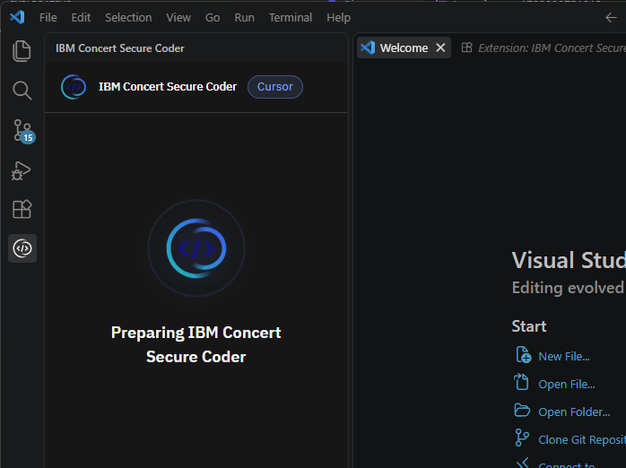

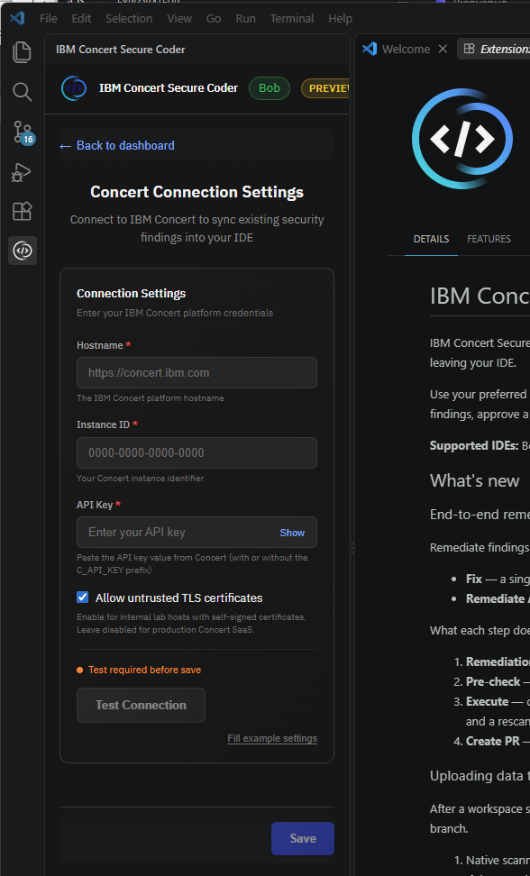


dans Concert icone secure coder sair BOB API key

https://bob.ibm.com/admin/apikeys

```

```

installer Bobshell CLI :

```
C:\Users\PatrickPothier\Bob> powershell ./bobshell.ps1
```

```powershell
# Parse command line arguments
param(
    [Parameter(Mandatory=$false)]
    [Alias("pm")]
    [ValidateSet("npm", "pnpm", "yarn", "")]
    [string]$PackageManager = ""
)

# Set execution policy for current process and child processes
Set-ExecutionPolicy -Scope Process -ExecutionPolicy Bypass -Force

# Color and symbol definitions
$script:Colors = @{
    Red     = [System.ConsoleColor]::Red
    Green   = [System.ConsoleColor]::Green
    Yellow  = [System.ConsoleColor]::Yellow
    Blue    = [System.ConsoleColor]::Blue
    Cyan    = [System.ConsoleColor]::Cyan
    White   = [System.ConsoleColor]::White
    Gray    = [System.ConsoleColor]::Gray
}

$script:Symbols = @{
    CheckMark = [char]::ConvertFromUtf32(0x2713)  # ✓
    CrossMark = [char]::ConvertFromUtf32(0x2717)  # ✗
    Arrow     = [char]::ConvertFromUtf32(0x2192)  # →
    Warning   = [char]::ConvertFromUtf32(0x26A0)  # ⚠
    Package   = [char]::ConvertFromUtf32(0x1F4E6) # 📦
    Download  = [char]::ConvertFromUtf32(0x2B07)  # ⬇
    Install   = [char]::ConvertFromUtf32(0x1F527) # 🔧
}

# Function to write colored output
function Write-ColorOutput {
    param(
        [string]$Message,
        [System.ConsoleColor]$ForegroundColor = [System.ConsoleColor]::White,
        [switch]$NoNewline
    )

    $previousColor = $Host.UI.RawUI.ForegroundColor
    $Host.UI.RawUI.ForegroundColor = $ForegroundColor

    if ($NoNewline) {
        Write-Host $Message -NoNewline
    } else {
        Write-Host $Message
    }

    $Host.UI.RawUI.ForegroundColor = $previousColor
}

# Helper functions for different message types
function Write-Info {
    param([string]$Message)
    Write-ColorOutput "$($script:Symbols.Arrow) " -ForegroundColor $script:Colors.Blue -NoNewline
    Write-Host $Message
}

function Write-Success {
    param([string]$Message)
    Write-ColorOutput "$($script:Symbols.CheckMark) " -ForegroundColor $script:Colors.Green -NoNewline
    Write-Host $Message
}

function Write-Error {
    param([string]$Message)
    Write-ColorOutput "$($script:Symbols.CrossMark) " -ForegroundColor $script:Colors.Red -NoNewline
    Write-Host $Message
}

function Write-Warning {
    param([string]$Message)
    Write-ColorOutput "$($script:Symbols.Warning)  " -ForegroundColor $script:Colors.Yellow -NoNewline
    Write-Host $Message
}

function Write-Header {
    param([string]$Message)
    Write-Host ""
    Write-ColorOutput $Message -ForegroundColor $script:Colors.Cyan
    Write-Host ""
}

# Function to check if a command is available
function Test-CommandExists {
    param ($command)
    $exists = $null -ne (Get-Command $command -ErrorAction SilentlyContinue)
    return $exists
}

# Function to check Node.js version
function Test-NodeVersion {
    Write-Header "Checking Node.js Installation"

    if (-not (Test-CommandExists "node")) {
        Write-Error "Node.js is not installed."
        Write-ColorOutput "  Please install Node.js version 22.15 or higher and try again." -ForegroundColor $script:Colors.Yellow
        exit 1
    }

    $nodeVersionOutput = node -v
    $nodeVersion = $nodeVersionOutput -replace '^v', ''
    $requiredVersion = [version]"22.15.0"
    $currentVersion = [version]$nodeVersion

    if ($currentVersion -lt $requiredVersion) {
        Write-Error "Node.js version $nodeVersion is installed, but version 22.15 or higher is required."
        Write-ColorOutput "  Please upgrade Node.js and try again." -ForegroundColor $script:Colors.Yellow
        exit 1
    }

    Write-Success "Node.js version $nodeVersion detected (minimum 22.15 required)"
}

# Check Node.js version first
Test-NodeVersion

# Package manager selection
Write-Header "Package Manager Selection"
Write-Host ""
if ($PackageManager -eq "") {
    Write-Info "Tip: You can skip this selection by using: -PackageManager or -pm (e.g., -pm npm)"
}

# Check which package managers are available
$availableManagers = @()
if (Test-CommandExists "npm") { $availableManagers += "npm" }
if (Test-CommandExists "pnpm") { $availableManagers += "pnpm" }
if (Test-CommandExists "yarn") { $availableManagers += "yarn" }

# Handle case where no package managers are available
if ($availableManagers.Count -eq 0) {
    Write-Error "No supported package managers (npm, pnpm, or yarn) found on your system."
    Write-ColorOutput "  Please install one of these package managers and try again." -ForegroundColor $script:Colors.Yellow
    exit 1
}

# Handle preselected package manager
$selected = ""
if ($PackageManager -ne "") {
    # Validate that the preselected package manager is available
    if ($availableManagers -contains $PackageManager) {
        $selected = $PackageManager
        Write-Info "Using preselected package manager: $selected"
    }
    else {
        Write-Error "Preselected package manager '$PackageManager' is not available."
        Write-ColorOutput "  Available options: $($availableManagers -join ', ')" -ForegroundColor $script:Colors.Yellow
        exit 1
    }
}
# If only one package manager is available, use it automatically
elseif ($availableManagers.Count -eq 1) {
    $selected = $availableManagers[0]
    Write-Info "Only $selected is available. Using it automatically."
}
# If multiple package managers are available, let the user choose
else {
    Write-ColorOutput "Available package managers:" -ForegroundColor $script:Colors.Cyan
    Write-Host ""

    # Display only available package managers
    $index = 1
    $optionMap = @{}

    foreach ($manager in $availableManagers) {
        Write-Host "  $index) " -NoNewline
        Write-ColorOutput $manager -ForegroundColor $script:Colors.White
        $optionMap[$index.ToString()] = $manager
        $index++
    }

    Write-Host ""

    # Read user input directly from console device
    $maxOption = $availableManagers.Count

    while ($selected -eq "") {
        Write-Host "Enter your choice (1-$maxOption): " -NoNewline -ForegroundColor $script:Colors.White
        $choice = Read-Host

        if ($optionMap.ContainsKey($choice)) {
            $selected = $optionMap[$choice]
            Write-Success "Selected $selected"
        }
        else {
            Write-Error "Invalid selection. Please enter a number between 1 and $maxOption."
        }
    }
}

Write-Host ""
Write-Header "Downloading bobshell"

# Fetch version with progress indicator
Write-Info "Fetching latest version..."

try {
    $version = (Invoke-WebRequest -Uri "https://s3.us-south.cloud-object-storage.appdomain.cloud/bob-shell/bobshell-version.txt" -UseBasicParsing).Content.Trim()

    if ([string]::IsNullOrWhiteSpace($version)) {
        Write-Error "Failed to fetch bobshell version"
        exit 1
    }

    Write-Success "Latest version: $version"
}
catch {
    Write-Error "Failed to fetch bobshell version: $_"
    exit 1
}

$dl_url = "https://s3.us-south.cloud-object-storage.appdomain.cloud/bob-shell/bobshell-${version}.tgz"

Write-Host ""
Write-Header "Installing bobshell"
Write-Info "Installing bobshell $version with $selected..."
Write-Host ""

# Function to show spinner during installation
function Show-Spinner {
    param(
        [System.Diagnostics.Process]$Process
    )

    $spinChars = @([char]0x280B, [char]0x2819, [char]0x2839, [char]0x2838, [char]0x283C, [char]0x2834, [char]0x2826, [char]0x2827, [char]0x2807, [char]0x280F)
    $i = 0

    while (-not $Process.HasExited) {
        $spinChar = $spinChars[$i % $spinChars.Length]
        Write-Host "`r " -NoNewline
        Write-ColorOutput "$spinChar" -ForegroundColor $script:Colors.Cyan -NoNewline
        Write-Host "  Installing...   " -NoNewline
        Start-Sleep -Milliseconds 100
        $i++
    }
    Write-Host "`r                                        `r" -NoNewline
}

# Install using the selected package manager
$installSuccess = $false

try {
    $logFileOut = Join-Path $env:TEMP "bobshell-install-out.log"
    $logFileErr = Join-Path $env:TEMP "bobshell-install-err.log"

    # Get the actual command path and extension to handle .cmd, .bat, .ps1, and .exe files
    $cmdInfo = Get-Command $selected -ErrorAction Stop
    $cmdPath = $cmdInfo.Source
    $extension = [System.IO.Path]::GetExtension($cmdPath).ToLower()

    # Build arguments based on package manager
    $installArgs = @()
    switch ($selected) {
        "pnpm" {
            $installArgs = @("add", "--reg=https://registry.npmjs.org/", "-g", $dl_url)
        }
        "npm" {
            $installArgs = @("install", "--reg=https://registry.npmjs.org/", "--progress=false", "--loglevel=error", "-g", $dl_url)
        }
        "yarn" {
            $Env:YARN_REGISTRY = "https://registry.npmjs.org/"
            $installArgs = @("global", "add", "--silent", $dl_url)
        }
    }

    # Determine how to execute based on file type (Windows-specific handling)
    $processPath = ""
    $processArgs = @()

    switch ($extension) {
        { $_ -in '.cmd', '.bat' } {
            # Batch files need cmd.exe
            $processPath = "cmd.exe"
            $processArgs = @('/c', "`"$cmdPath`"") + $installArgs
        }
        '.ps1' {
            # PowerShell scripts need powershell.exe
            $processPath = "powershell.exe"
            $processArgs = @('-ExecutionPolicy', 'Bypass', '-File', "`"$cmdPath`"") + $installArgs
        }
        default {
            # Assume it's a native executable (.exe)
            $processPath = $cmdPath
            $processArgs = $installArgs
        }
    }

    $process = Start-Process -FilePath $processPath -ArgumentList $processArgs -NoNewWindow -PassThru -RedirectStandardOutput $logFileOut -RedirectStandardError $logFileErr
    Show-Spinner -Process $process
    $process.WaitForExit()

    # Verify installation properly instead of relying on exit code
    if (Test-CommandExists "bob") {
        try {
            $versionOutput = & bob --version 2>$null
            $installedVersion = ($versionOutput | Select-Object -Last 1).Trim()
            if ($installedVersion -eq $version) {
                $installSuccess = $true
            }
            else {
                Write-Warning "Version mismatch: installed $installedVersion, expected $version"
            }
        }
        catch {
            Write-Warning "bob command exists but version check failed: $_"
        }
    }
}
catch {
    Write-Error "Installation failed: $_"
}

Write-Host ""
if ($installSuccess) {
    Write-Header "Installation Complete! $($script:Symbols.CheckMark)"
    Write-Success "bobshell $version has been successfully installed"
    Write-Host ""
    Write-Info "You can now run: bob"
    Write-Host ""

    # Telemetry Notice for External Users
    Write-ColorOutput "Usage data is collected by default." -ForegroundColor $script:Colors.Cyan
    Write-Host ""
    Write-Info "To opt out, type /settings, navigate to Enable Usage Metrics and set the flag to false"
    Write-Host ""

    # Clean up log files
    if (Test-Path $logFileOut) { Remove-Item $logFileOut -Force -ErrorAction SilentlyContinue }
    if (Test-Path $logFileErr) { Remove-Item $logFileErr -Force -ErrorAction SilentlyContinue }
}
else {
    Write-Error "Installation failed"
    Write-Host ""

    # Show error logs if they exist
    if (Test-Path $logFileErr) {
        $errorContent = Get-Content $logFileErr -Raw -Encoding UTF8
        if (-not [string]::IsNullOrWhiteSpace($errorContent)) {
            Write-ColorOutput "Error details:" -ForegroundColor $script:Colors.Red
            Write-Output $errorContent
        }
        Remove-Item $logFileErr -Force -ErrorAction SilentlyContinue
    }

    if (Test-Path $logFileOut) {
        $errorContent = Get-Content $logFileOut -Raw -Encoding UTF8
        if (-not [string]::IsNullOrWhiteSpace($errorContent)) {
            Write-ColorOutput "Error details:" -ForegroundColor $script:Colors.Red
            Write-Output $errorContent
        }
        Remove-Item $logFileOut -Force -ErrorAction SilentlyContinue
    }

    exit 1
}

exit 0

```


```bash
npm config set allow-scripts=node-pty --location=user
npm install --reg=https://registry.npmjs.org/ -g ".\bobshell-1.0.6.tgz"
```


https://girhub.com/patpot44/demo-locale-concert.git


dans concert icone Secure Coder :

renseigner BOB API Key :


Secure Coder 11:12 AM

Hi, ibmconcert!

👋 Welcome to Secure Coder! To get started, I need your IBM Bob API  key. This key is required to enable all chat functions. 🔐 Your key will be transmitted securely and used only for this session. Add an API key:

You 11:13 AM

Bob API key selected


Secure Coder 11:13 AM

90.08s


1.37


1.Fetch Auto-Remediation Actions


2.Display Problem Metrics


3.Show Available Actions Table


4.Present Key Insights


5.Highlight Priority Actions


6.Provide Follow-Up Options

Total Actions

12

Critical Vulnerabilities

28

High Severity Issues

35

Risk Reduction Potential

94%

|      |                      |                 |          |          |      |      |
| ---- | -------------------- | --------------- | -------- | -------- | ---- | ---- |
| 1    | erp-backend (image)  | Package Upgrade | 6 CVEs   | CRITICAL | 86%  |      |
| 2    | erp-frontend (image) | Package Upgrade | 4 CVEs   | CRITICAL | 100% |      |
| 3    | erp-core-api         | Package Upgrade | 11 CVEs  | CRITICAL | 100% |      |
| 4    | erp-web-app          | Package Upgrade | 11 CVEs  | CRITICAL | 100% |      |
| 5    | erp-finance-module   | Package Upgrade | 11 CVEs  | CRITICAL | 100% |      |
| 6    | erp-db-migrations    | Package Upgrade | 11 CVEs  | CRITICAL | 100% |      |
| 8    | erp-backend (image)  | SBOM Upgrade    | 7 CVEs   | CRITICAL | 58%  |      |
| 10   | erp-core-api         | Code Security   | 10 Rules | CRITICAL | 100% |      |
| 11   | erp-finance-module   | Code Security   | 10 Rules | CRITICAL | 100% |      |
| 12   | erp-web-app          | Code Security   | 10 Rules | BLOCKER  | 100% |      |
| 13   | erp-db-migrations    | Code Security   | 10 Rules | CRITICAL | 100% |      |
| 14   | erp-hr-module        | Code Security   | 10 Rules | CRITICAL | 100% |      |


#### Key Insights

- **Critical Security Gaps**  28 critical vulnerabilities detected including Log4Shell (CVE-2021-44228 - CVSS 10.0), hardcoded database credentials, and weak encryption  algorithms (DES, MD5)
- **Immediate Action Required** 6 package upgrade actions address dependency vulnerabilities across  container images and repositories with 86-100% risk reduction
- **Code Security Issues** 5 code security actions fix 50 security rules including command injection, insecure JWT validation, and hardcoded API keys
- **High Confidence Remediations** All 12 actions have 'high' confidence factor with automated pull request generation ready for review

**Priority Actions:** Start with Action #3 (erp-core-api) - fixes 11 critical CVEs including  Log4Shell (CVE-2021-44228). Follow with Action #10 (erp-core-api code  security) to address 10 critical security rules including hardcoded  credentials and command injection vulnerabilities.

You 11:15 AM

Show detailed vulnerability analysis for a specific action

%20scale(2.707%20-1.679)'%20gradientUnits='userSpaceOnUse'%3e%3cstop%20offset='.1'%20stop-opacity='0'/%3e%3cstop%20offset='.7'/%3e%3c/linearGradient%3e%3clinearGradient%20id='vtj3xclh6b'%20x1='283.492'%20y1='-72.378'%20x2='288.624'%20y2='-72.378'%20gradientTransform='rotate(-30%20675.159%201360.53)%20scale(2.707%201.679)'%20xlink:href='%233pgjrqutda'/%3e%3clinearGradient%20id='a65td6y9rc'%20x1='493.755'%20y1='266.345'%20x2='497.452'%20y2='266.137'%20gradientTransform='rotate(150%20737.73%2050.38)%20scale(2.707%201.679)'%20xlink:href='%233pgjrqutda'/%3e%3clinearGradient%20id='cvvruxj4kd'%20x1='531.808'%20y1='160.06'%20x2='535.504'%20y2='159.851'%20gradientTransform='rotate(-150%20769.615%2068.62)%20scale(2.707%20-1.679)'%20xlink:href='%233pgjrqutda'/%3e%3clinearGradient%20id='zw76178egf'%20x1='-1090'%20y1='32'%20x2='-1122'%20y2='0'%20gradientTransform='matrix(1%200%200%20-1%201122%2032)'%20gradientUnits='userSpaceOnUse'%3e%3cstop%20offset='.1'%20stop-color='%233ddad8'/%3e%3cstop%20offset='.9'%20stop-color='%234588ff'/%3e%3c/linearGradient%3e%3cmask%20id='c6n68cswoe'%20x='0'%20y='0'%20width='32'%20height='32'%20maskUnits='userSpaceOnUse'%3e%3cpath%20d='M16%2030C8.28%2030%202%2023.72%202%2016S8.28%202%2016%202a13.86%2013.86%200%200%201%208.616%202.965L23.384%206.54A11.877%2011.877%200%200%200%2016%204C9.383%204%204%209.383%204%2016s5.383%2012%2012%2012c2.705%200%205.259-.878%207.384-2.54l1.232%201.576A13.868%2013.868%200%200%201%2016%2030z'%20style='fill:%23fff'/%3e%3cpath%20style='fill:url(%233pgjrqutda)'%20d='M14%201h12v7H14z'/%3e%3cpath%20style='fill:url(%23vtj3xclh6b)'%20d='M14%2024h12v7H14z'/%3e%3cpath%20d='M20%2026a10.013%2010.013%200%200%201-7.453-3.333l1.49-1.334A8.012%208.012%200%200%200%2020%2024c4.411%200%208-3.589%208-8s-3.589-8-8-8a8.012%208.012%200%200%200-5.963%202.667l-1.49-1.334A10.013%2010.013%200%200%201%2020%206c5.514%200%2010%204.486%2010%2010s-4.486%2010-10%2010z'%20style='fill:%23fff'/%3e%3cpath%20style='fill:url(%23a65td6y9rc)'%20d='M12%205h8l4%206H12V5z'/%3e%3cpath%20style='fill:url(%23cvvruxj4kd)'%20d='M12%2027h8l4-6H12v6z'/%3e%3c/mask%3e%3c/defs%3e%3cg%20style='mask:url(%23c6n68cswoe)'%3e%3cpath%20transform='rotate(180%2016%2016)'%20style='fill:url(%23zw76178egf)'%20d='M0%200h32v32H0z'/%3e%3c/g%3e%3cpath%20d='m22.17%2016.088-2.58%202.58%201.41%201.42%204-4-4-4-1.42%201.41%202.59%202.59zm-12.34%200%202.58-2.58-1.41-1.42-4%204%204%204%201.42-1.41-2.59-2.59zM13.74%2020.659%2016.328%2011l1.932.518-2.588%209.659-1.932-.518z'%20style='fill:%23f4f4f4'/%3e%3c/svg%3e)

Secure Coder 11:15 AM

39.33s


0.75


Please specify which action ID you'd like to analyze in detail. Available actions:

**Package Upgrades:**

- Action #1: erp-backend (6 CVEs)
- Action #2: erp-frontend (4 CVEs)
- Action #3: erp-core-api (11 CVEs) - **Recommended**
- Action #4: erp-web-app (11 CVEs)
- Action #5: erp-finance-module (11 CVEs)
- Action #6: erp-db-migrations (11 CVEs)
- Action #8: erp-backend SBOM (7 CVEs)

**Code Security:**

- Action #10: erp-core-api (10 rules) - **Recommended**
- Action #11: erp-finance-module (10 rules)
- Action #12: erp-web-app (10 rules)
- Action #13: erp-db-migrations (10 rules)
- Action #14: erp-hr-module (10 rules)

Enter the action ID number (e.g., 3 or 10):

You 11:23 AM

Analyze Action #3 (erp-core-api - 11 CVEs)

%20scale(2.707%20-1.679)'%20gradientUnits='userSpaceOnUse'%3e%3cstop%20offset='.1'%20stop-opacity='0'/%3e%3cstop%20offset='.7'/%3e%3c/linearGradient%3e%3clinearGradient%20id='vtj3xclh6b'%20x1='283.492'%20y1='-72.378'%20x2='288.624'%20y2='-72.378'%20gradientTransform='rotate(-30%20675.159%201360.53)%20scale(2.707%201.679)'%20xlink:href='%233pgjrqutda'/%3e%3clinearGradient%20id='a65td6y9rc'%20x1='493.755'%20y1='266.345'%20x2='497.452'%20y2='266.137'%20gradientTransform='rotate(150%20737.73%2050.38)%20scale(2.707%201.679)'%20xlink:href='%233pgjrqutda'/%3e%3clinearGradient%20id='cvvruxj4kd'%20x1='531.808'%20y1='160.06'%20x2='535.504'%20y2='159.851'%20gradientTransform='rotate(-150%20769.615%2068.62)%20scale(2.707%20-1.679)'%20xlink:href='%233pgjrqutda'/%3e%3clinearGradient%20id='zw76178egf'%20x1='-1090'%20y1='32'%20x2='-1122'%20y2='0'%20gradientTransform='matrix(1%200%200%20-1%201122%2032)'%20gradientUnits='userSpaceOnUse'%3e%3cstop%20offset='.1'%20stop-color='%233ddad8'/%3e%3cstop%20offset='.9'%20stop-color='%234588ff'/%3e%3c/linearGradient%3e%3cmask%20id='c6n68cswoe'%20x='0'%20y='0'%20width='32'%20height='32'%20maskUnits='userSpaceOnUse'%3e%3cpath%20d='M16%2030C8.28%2030%202%2023.72%202%2016S8.28%202%2016%202a13.86%2013.86%200%200%201%208.616%202.965L23.384%206.54A11.877%2011.877%200%200%200%2016%204C9.383%204%204%209.383%204%2016s5.383%2012%2012%2012c2.705%200%205.259-.878%207.384-2.54l1.232%201.576A13.868%2013.868%200%200%201%2016%2030z'%20style='fill:%23fff'/%3e%3cpath%20style='fill:url(%233pgjrqutda)'%20d='M14%201h12v7H14z'/%3e%3cpath%20style='fill:url(%23vtj3xclh6b)'%20d='M14%2024h12v7H14z'/%3e%3cpath%20d='M20%2026a10.013%2010.013%200%200%201-7.453-3.333l1.49-1.334A8.012%208.012%200%200%200%2020%2024c4.411%200%208-3.589%208-8s-3.589-8-8-8a8.012%208.012%200%200%200-5.963%202.667l-1.49-1.334A10.013%2010.013%200%200%201%2020%206c5.514%200%2010%204.486%2010%2010s-4.486%2010-10%2010z'%20style='fill:%23fff'/%3e%3cpath%20style='fill:url(%23a65td6y9rc)'%20d='M12%205h8l4%206H12V5z'/%3e%3cpath%20style='fill:url(%23cvvruxj4kd)'%20d='M12%2027h8l4-6H12v6z'/%3e%3c/mask%3e%3c/defs%3e%3cg%20style='mask:url(%23c6n68cswoe)'%3e%3cpath%20transform='rotate(180%2016%2016)'%20style='fill:url(%23zw76178egf)'%20d='M0%200h32v32H0z'/%3e%3c/g%3e%3cpath%20d='m22.17%2016.088-2.58%202.58%201.41%201.42%204-4-4-4-1.42%201.41%202.59%202.59zm-12.34%200%202.58-2.58-1.41-1.42-4%204%204%204%201.42-1.41-2.59-2.59zM13.74%2020.659%2016.328%2011l1.932.518-2.588%209.659-1.932-.518z'%20style='fill:%23f4f4f4'/%3e%3c/svg%3e)

Secure Coder 11:23 AM

89.52s


1.59


**Action #3 Detailed Analysis: erp-core-api Package Upgrades**

**Target Repository:** https://github.com/techcorp/erp-core-api (main branch)

**Vulnerability Overview:**

- **Total CVEs Fixed:** 11
- **Risk Reduction:** 100%
- **Confidence Factor:** High
- **Action Type:** Pull Request - Package Upgrade

**Critical Vulnerabilities (CVSS 9.0+):**

1. **CVE-2021-44228** (Log4Shell) - CVSS 10.0 - CRITICAL
   - Package: log4j-core 2.14.1 - 2.17.1
   - Impact: Remote Code Execution via JNDI injection
2. **CVE-2024-23897** - CVSS 9.8 - CRITICAL
   - Package: jenkins 2.426 - 2.442
   - Impact: Arbitrary file read vulnerability
3. **CVE-2022-22965** (Spring4Shell) - CVSS 9.8 - CRITICAL
   - Package: spring-webmvc 5.3.15 - 5.3.18
   - Impact: Remote Code Execution via class loader manipulation

**High Severity Vulnerabilities (CVSS 7.0-8.9):** 4. **CVE-2024-27980** - CVSS 8.1 - HIGH

- Package: node 18.18.0 - 18.20.2

1. **CVE-2024-29415** - CVSS 8.1 - HIGH
   - Package: ip 1.1.8 - 2.0.1
2. **CVE-2024-34351** - CVSS 7.5 - HIGH
   - Package: next 14.0.4 - 14.1.1

**Security Weaknesses (CWE):** 7. **CWE-352** - Cross-Site Request Forgery

- Package: spring-security 5.7.5 - 5.8.0

1. **CWE-89** - SQL Injection
   - Package: hibernate-core 5.6.1 - 5.6.15
2. **CWE-502** - Deserialization of Untrusted Data
   - Package: commons-collections 3.2.1 - 3.2.2
3. **CWE-326** - Inadequate Encryption Strength
   - Package: bouncycastle 1.68 - 1.75
4. **CWE-79** - Cross-Site Scripting (XSS)
   - Package: react-dom 18.2.0 - 18.3.0

**Remediation Summary:** All 11 packages will be upgraded to secure versions via automated pull  request. The action addresses the most critical vulnerabilities in the  ERP core API, including the infamous Log4Shell and Spring4Shell  exploits.

Critical CVEs

3

High Severity CVEs

3

Security Weaknesses

5

Risk Reduction

100%

|                     |         |         |                |          |      |      |
| ------------------- | ------- | ------- | -------------- | -------- | ---- | ---- |
| log4j-core          | 2.14.1  | 2.17.1  | CVE-2021-44228 | CRITICAL | 10.0 |      |
| jenkins             | 2.426   | 2.442   | CVE-2024-23897 | CRITICAL | 9.8  |      |
| spring-webmvc       | 5.3.15  | 5.3.18  | CVE-2022-22965 | CRITICAL | 9.8  |      |
| node                | 18.18.0 | 18.20.2 | CVE-2024-27980 | HIGH     | 8.1  |      |
| ip                  | 1.1.8   | 2.0.1   | CVE-2024-29415 | HIGH     | 8.1  |      |
| next                | 14.0.4  | 14.1.1  | CVE-2024-34351 | HIGH     | 7.5  |      |
| spring-security     | 5.7.5   | 5.8.0   | CWE-352        | MEDIUM   | N/A  |      |
| hibernate-core      | 5.6.1   | 5.6.15  | CWE-89         | MEDIUM   | N/A  |      |
| commons-collections | 3.2.1   | 3.2.2   | CWE-502        | MEDIUM   | N/A  |      |
| bouncycastle        | 1.68    | 1.75    | CWE-326        | MEDIUM   | N/A  |      |
| react-dom           | 18.2.0  | 18.3.0  | CWE-79         | MEDIUM   | N/A  |      |


#### Action #3 Critical Insights

- **Log4Shell Vulnerability**  CVE-2021-44228 (CVSS 10.0) in log4j-core 2.14.1 enables remote code  execution. This is one of the most severe vulnerabilities ever  discovered and requires immediate remediation.
- **Spring4Shell Detected**  CVE-2022-22965 (CVSS 9.8) in spring-webmvc 5.3.15 allows RCE via class  loader manipulation. Combined with Log4Shell, this creates a critical  attack surface.
- **Multiple RCE Vectors** 3 critical CVEs (CVSS 9.8-10.0) and 3 high severity CVEs (CVSS 7.5-8.1)  provide multiple remote code execution pathways that attackers can  exploit.
- **Automated Remediation Ready**  All 11 package upgrades are available with high confidence. Pull request can be generated immediately to address 100% of identified  vulnerabilities in erp-core-api.


------

### 4. Utiliser Secure Coder

Ouvrez un fichier de code (ex. un `pom.xml`, `package.json`, ou fichier Java/Python) — le plugin analyse automatiquement les dépendances et affiche dans la barre latérale les CVEs détectés, corrélés avec votre instance Concert.


C'est normal — le plugin Secure Coder scanne le workspace **localement** (mode "Local workspace scan") et remonte ses propres findings. Ces findings ne sont pas forcément les mêmes que ceux importés via vos CSV dans Concert.

Vérifions ce qui existe dans Concert côté CVEs :

Retrouvons les bons endpoints API Concert :


La situation est claire. Voici l'explication :

------

### Pourquoi CVE-2025-66614 n'est pas dans Concert ?

**Deux sources de données différentes :**

| Source                            | Contenu                                                      | Visible où                     |
| --------------------------------- | ------------------------------------------------------------ | ------------------------------ |
| **Secure Coder (plugin VS Code)** | Scan local du workspace `transaction-banking-service` — packages Java/Maven réels dans le code ouvert | Uniquement dans le plugin IDE  |
| **Concert UI (votre instance)**   | CVEs importés via `04_code_scan_sast.csv` — données `techcorp-erp` que vous avez chargées manuellement | Concert Dashboard / Dimensions |

Le plugin a scanné un **repo différent** (`transaction-banking-service`) qui contient du code Java avec `tomcat-embed-core@9.0.63` — ce n'est pas `techcorp-erp`. Concert ne connaît pas encore ces packages car ils n'ont pas été importés via SBOM.

------

### ✅ Ce que vous avez dans Concert (04_code_scan_sast.csv)

Les CVEs déjà dans Concert sont :

| CVE                | Package              | Score | Sévérité   |
| ------------------ | -------------------- | ----- | ---------- |
| **CVE-2021-44228** | log4j-core 2.14.1    | 10.0  | 🔴 Critical |
| **CVE-2022-22965** | spring-webmvc 5.3.15 | 9.8   | 🔴 Critical |
| **CVE-2024-29415** | ip 1.1.8             | 9.8   | 🔴 Critical |
| **CVE-2024-23897** | jenkins 2.426        | 9.8   | 🔴 Critical |
| **CVE-2024-25600** | bricks-builder 1.9.5 | 9.8   | 🔴 Critical |
| CVE-2024-34351     | next 14.0.4          | 7.5   | 🟠 High     |
| CVE-2024-27980     | node 18.18.0         | 8.1   | 🟠 High     |

------

### 🎯 Solution pour la démo : deux approches

### Option A — Démo "découplée" (recommandée, sans modification)

Montrez les **deux vues séparément** en expliquant le flux :

> *"Le développeur voit les findings dans son IDE via Secure Coder (**165 issues, score 10/10**). Quand il applique une remédiation, elle remonte automatiquement dans Concert — ici on voit les CVEs qui ont déjà été traités par l'équipe : Log4Shell CVE-2021-44228, Spring4Shell CVE-2022-22965..."*


```
wsl -d RHEL-10.1 cp "/mnt/c/D1To/Perso/Patrick/DOCS/Customer Success Manager Architect/Automation/Concert/demo locale/concert-demo/11_app_sbom_transaction_banking.json" /tmp/ 2>&1; wsl -d RHEL-10.1 cp "/mnt/c/D1To/Perso/Patrick/DOCS/Customer Success Manager Architect/Automation/Concert/demo locale/concert-demo/12_package_sbom_transaction_banking.json" /tmp/ 2>&1; echo "Copie OK"
```


# log vscode :

```
$log = "$env:APPDATA\Code\logs\20260903T203613\window1\exthost\output_logging_20260903T205358\1-I*" $file = Get-ChildItem $log -ErrorAction SilentlyContinue | Select-Object -First 1 if ($file) { Get-Content $file.FullName -Tail 80 } else { Write-Host "fichier non trouvé" }
```

```
filesystem logs: C:\Users\PatrickPothier\.concert-protect\tmp\cd5141af4fc5ca428fdfed38\session-2026-09-03-1788461640399.log
```

```
c:\Users\PatrickPothier\appdata\Roaming\Code\User\setting.json
```

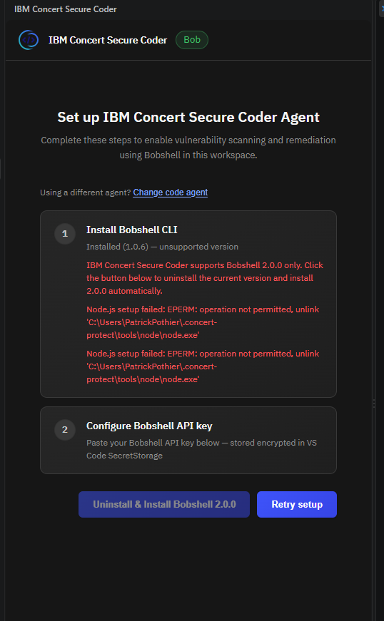

https://s3.us-south.cloud-object-storage.appdomain.cloud/bobshell/bobshell-$

```powershell
$url = "https://s3.us-south.cloud-object-storage.appdomain.cloud/bobshell/bobshell-2.0.0.tgz" $tgzPath = "$env:USERPROFILE\.concert-protect\tools\cache\bobshell-2.0.0.tgz" $nodeExe = "$env:USERPROFILE\.concert-protect\tools\node\node.exe" $npmCli = "$env:USERPROFILE\.concert-protect\tools\node\node_modules\npm\bin\npm-cli.js" $prefix = "$env:USERPROFILE\.concert-protect\tools\npm" Write-Host "=== Téléchargement bobshell 2.0.0 ===" Invoke-WebRequest -Uri $url -OutFile $tgzPath -UseBasicParsing Write-Host "Taille: $((Get-Item $tgzPath).Length) bytes"
```

API-KEY BOB new :

```
bob_prod_bob-user_2N3eMjWzECMYLpnSHc8yZ5FJvNv6Se3UfNbZSFokp2jriF4DhWEjtvQtuARpaW1bR1ZdFdTBHSaTHZ3HJXvjTCF9_6NW12JKuuWiUz1qriEfSneG6MKri9ZoJrS1bPvAWnsi1
```


# test David

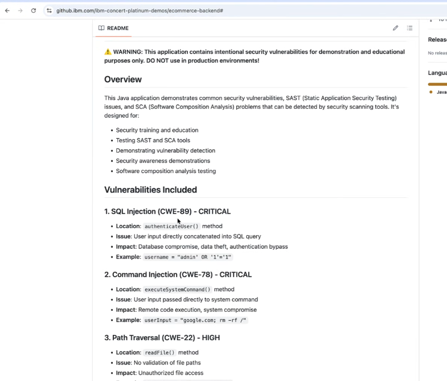

trivy Gitleaks

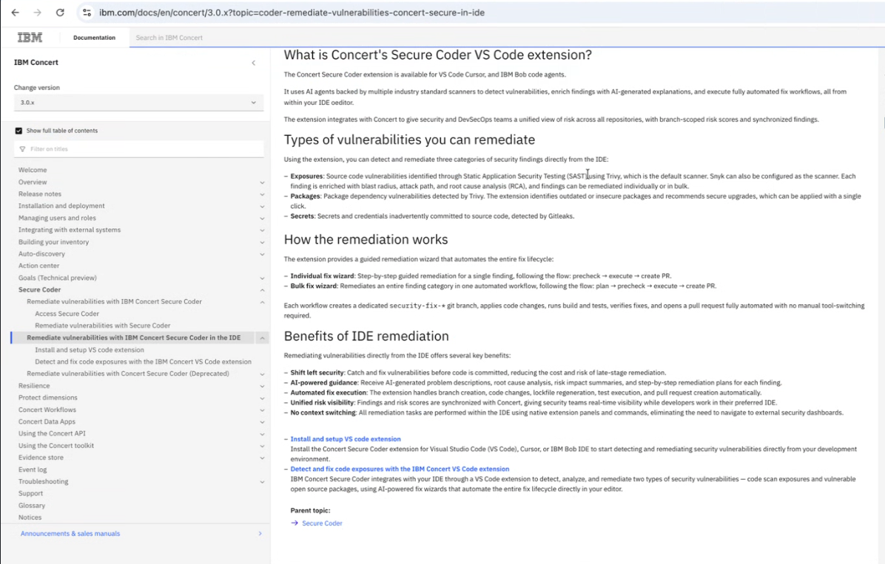


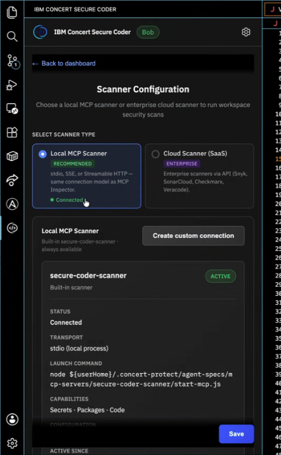

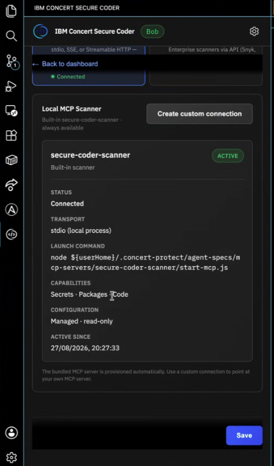

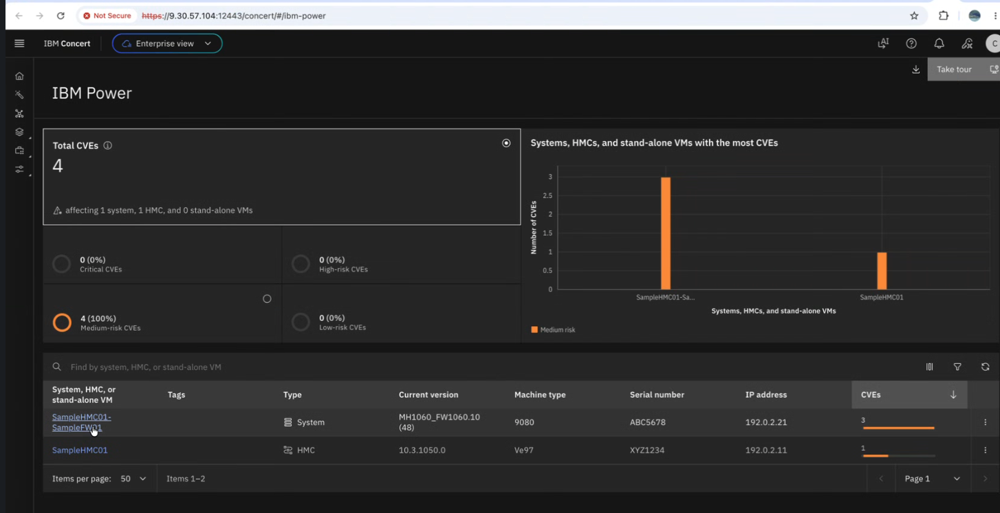


instance saas

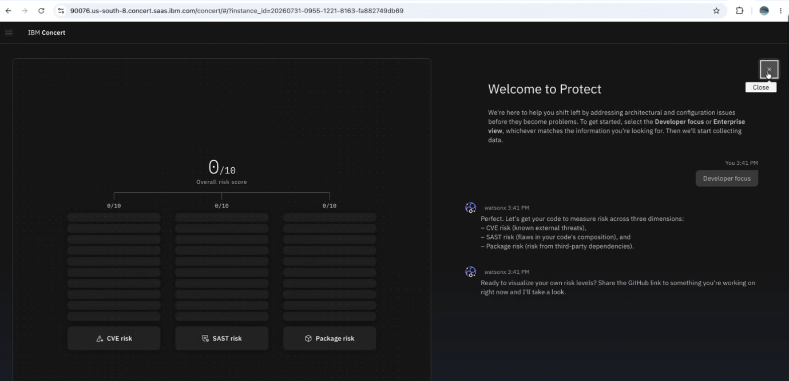


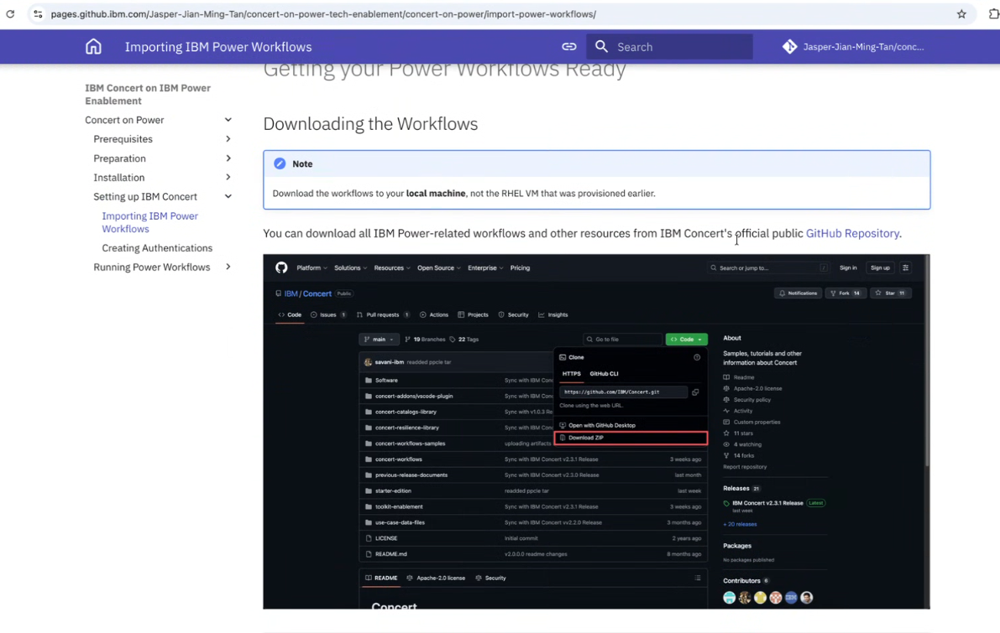

## POWER :

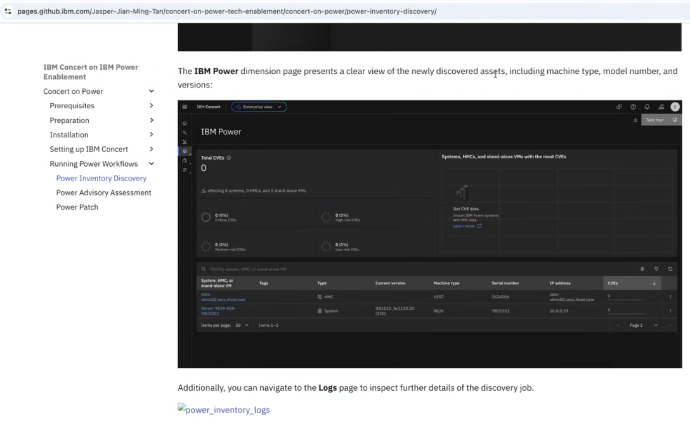

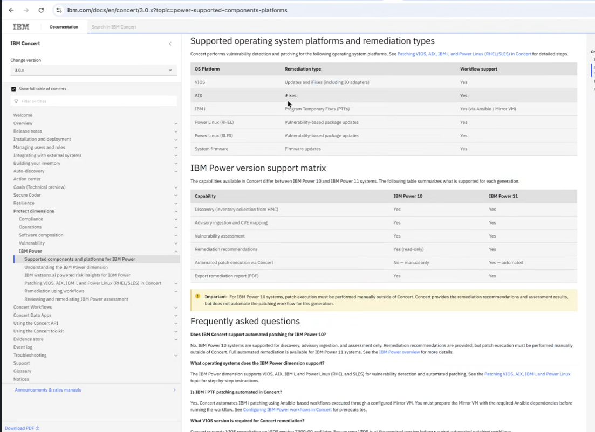

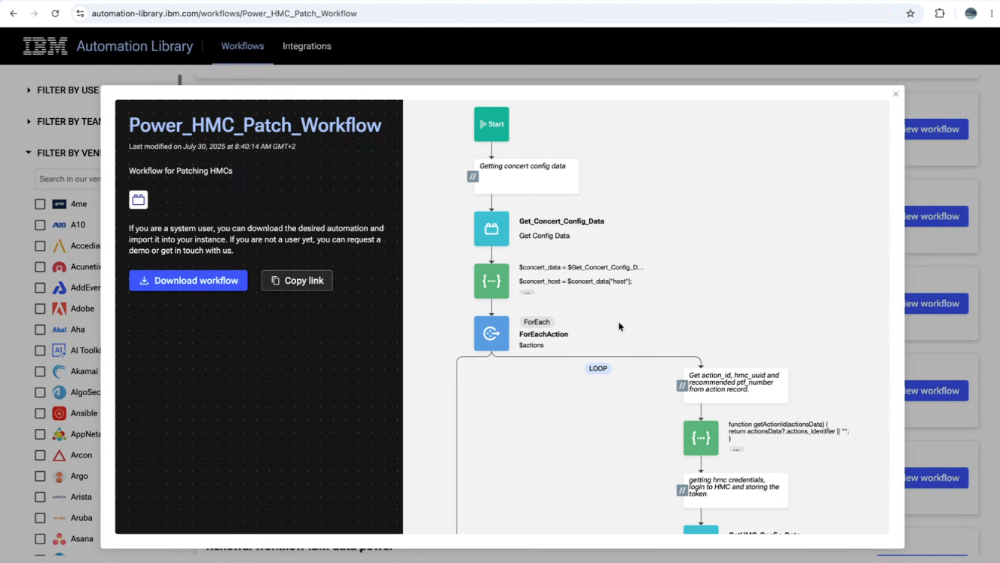


github.ibm.com for blue-bank (PAT) :

```
ghp_YOUR_GITHUB_TOKEN_HERE_PLACEHOLDER_2
```


developpers 

import application

https://github.com/patpot44/technical-corp-web.git


# travail commun

## 04/09/2026 - atelier interne


déjà des choix

scenarios : 

MOP : chemin pris = officialiser au bon niveau

fédérer données qui viennent de partout

protect en SaaS avec existant

certificat

compliance => rapport le dernier geste

ils ont déjà 
CVE =
mouliner

valeur de ça

réconcilie plein de données

persona :
definition de role

si on s'adresse au dev = pas issue

certain client :
progiciel : pas propriéte du code

process generique

(maintenabilité)

client :
mal à collecter ifo du client

important :
Crédit Agricole (POWER)

deal reproductible

patching 

collecte de Data
Dinesh = besoin executable 1 rapport / VM

reponse contrainte de compliance

